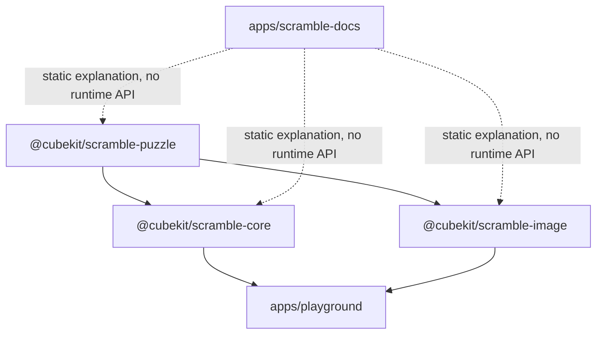

# CubeKit Package Boundaries



CubeKit splits TNoodle-compatible behavior into three packages so puzzle
semantics, generation, and rendering can be tested independently.

## `scramble-puzzle`

This package owns WCA event metadata, move parsers, state transitions, and puzzle
definitions. It answers: "What does this notation mean, and what puzzle state
does it produce?"

## `scramble-core`

This package owns random sources, event dispatch, solvers, and event-specific
generation rules. It answers: "Given a WCA event, how do we generate a valid
scramble?"

## `scramble-image`

This package owns the SVG builder and puzzle-specific renderers. It answers:
"Given an event and a scramble, what final state should be drawn?"

## Verification Strategy

All three packages have package-local tests and coverage thresholds. The focus is
not forcing every private defensive branch directly; it is WCA contracts,
parser/state behavior, generator boundaries, and SVG output shape.

Common commands:

```bash
pnpm --filter @cubekit/scramble-puzzle test:coverage
pnpm --filter @cubekit/scramble-core test:coverage
pnpm --filter @cubekit/scramble-image test:coverage
pnpm --filter playground build
```

Production app migration to these packages should be designed separately,
especially around worker/runtime behavior. This learning site only explains the
principles; interactive validation remains in `apps/playground`.

More reading:

- [scramble-puzzle README](https://github.com/deweyou/cubekit/blob/main/packages/scramble-puzzle/README.md)
- [scramble-core README](https://github.com/deweyou/cubekit/blob/main/packages/scramble-core/README.md)
- [scramble-image README](https://github.com/deweyou/cubekit/blob/main/packages/scramble-image/README.md)
