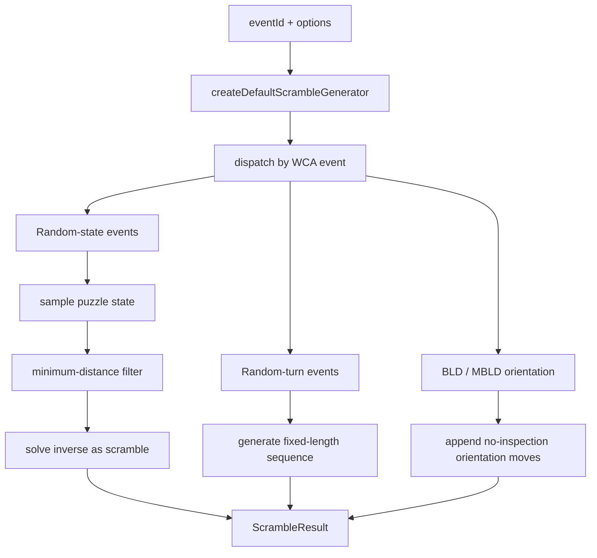

# Generation Pipeline

`@cubekit/scramble-core` starts with a generator facade. The caller passes a WCA
`eventId`, and the default generator dispatches to the event implementation:
3x3 uses min2phase, 4x4 uses threephase, Square-1 uses sq12phase, 2x2/Pyraminx/
Skewb use dedicated solvers, and 5x5/6x6/7x7/Megaminx/Clock use random-turn
families.

## Random-State Pipeline

Random-state events first target a legal state, then output a sequence that
reaches it:

1. Sample a state from the puzzle state space.
2. Use a solver to check whether it is too close to solved.
3. Resample when the state violates the WCA minimum.
4. Solve the accepted state and use the inverse solution as the scramble.

That is why 2x2, Pyraminx, Skewb, and Square-1 tests explicitly cover rejection
of states that are too close to solved.

## Random-Turn Pipeline

Some events are too expensive for full random-state generation or are allowed by
the regulations to use random turns. For 5x5/6x6/7x7 and Megaminx, CubeKit uses
fixed-length sequences and avoids obvious adjacent-axis collisions while
generating them. The goal is to align with the WCA "enough random moves"
requirement for these events.

## Blindfolded And Multi-Blind

`333bld`, `444bld`, and `555bld` append random orientation moves to the base
scramble. `333mbld` is not one extra-long 3x3 scramble; it returns one
blindfolded 3x3 scramble per cube, separated by newlines. The playground splits
those rows into separate displayed attempts.

Key files:

- [`packages/scramble-core/src/generator.ts`](https://github.com/deweyou/cubekit/blob/main/packages/scramble-core/src/generator.ts)
- [`packages/scramble-core/src/generators/three-by-three.ts`](https://github.com/deweyou/cubekit/blob/main/packages/scramble-core/src/generators/three-by-three.ts)
- [`packages/scramble-core/src/generators/square1.ts`](https://github.com/deweyou/cubekit/blob/main/packages/scramble-core/src/generators/square1.ts)
