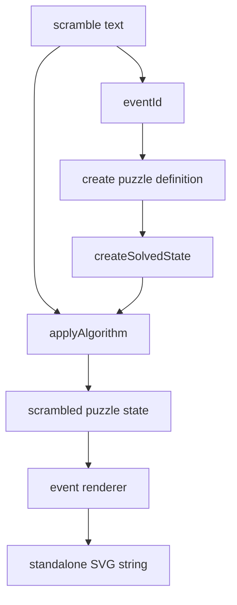

# Image Rendering Pipeline

A scramble image is not drawn directly from the string. The renderer first
applies the scramble to a solved puzzle state, then renders the resulting sticker
state as SVG.

## Dispatch

`renderScrambleImage(eventId, scramble)` uses
`WCA_EVENT_INFO[eventId].puzzleId` to choose the puzzle family. Cube events then
map to a size: `222` is a 2x2 net, `333bld` and a selected `333mbld` row render
as 3x3, and `555bld` renders as 5x5.

## Renderers

Different puzzles need different layouts:

- Cube-family events render as unfolded cube nets.
- Clock renders two dial faces and pin state.
- Megaminx, Pyraminx, Skewb, and Square-1 use puzzle-specific geometry.

Every renderer returns a string. It does not depend on DOM, canvas, or React, so
the same package can run in Node tests, browser workers, and static diagnostics.

## Why SVG Is A String

String output keeps the boundary simple: `scramble-image` creates safe,
serializable SVG; callers decide whether to inject it into a page, download it,
or use it in tests. The playground download action wraps that SVG string in a
Blob.

Key files:

- [`packages/scramble-image/src/render.ts`](https://github.com/deweyou/cubekit/blob/main/packages/scramble-image/src/render.ts)
- [`packages/scramble-image/src/renderers/cube-net.ts`](https://github.com/deweyou/cubekit/blob/main/packages/scramble-image/src/renderers/cube-net.ts)
- [`packages/scramble-image/src/svg/svg-serialize.ts`](https://github.com/deweyou/cubekit/blob/main/packages/scramble-image/src/svg/svg-serialize.ts)
