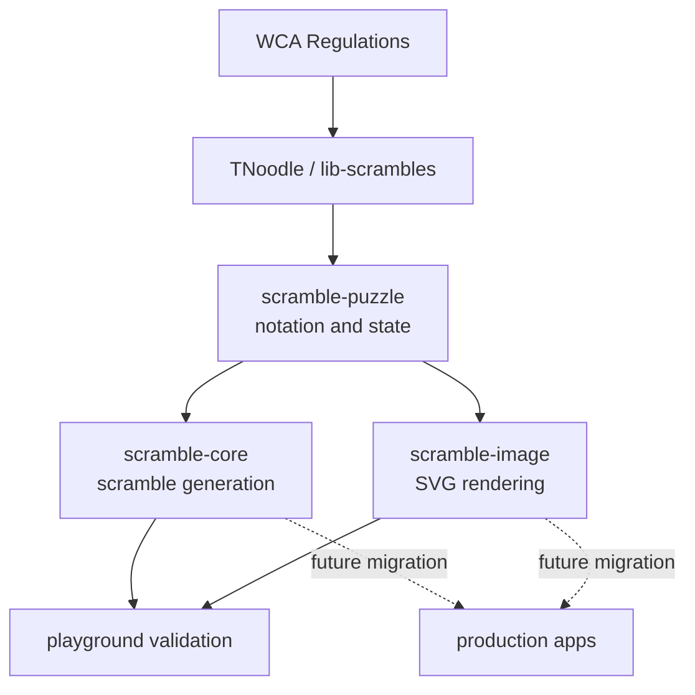

# WCA Scramble Generation And Images

::: warning Official WCA status
CubeKit is not an official WCA scramble program. Official competitions must use
the current official WCA scramble program published by the World Cube
Association.
:::

This site explains the engineering principles behind WCA scramble generation and
scramble image rendering in CubeKit. It is not API reference and it is not a
competition tool. Its job is to make three ideas clear:

- Why WCA fairness is centered on random states, not arbitrary random turns.
- How a TNoodle-style generator combines events, random sources, solvers, and
  event-specific rules.
- Why scramble images depend on move parsing and state transitions instead of
  drawing the scramble string directly.

CubeKit currently tracks TNoodle-WCA `1.2.3` and `thewca/tnoodle-lib v0.19.2`.
The version record and upgrade flow live in the repository's
[TNoodle baseline](https://github.com/deweyou/cubekit/blob/main/docs/tnoodle-baseline.md).

## Learning Path

1. Start with [WCA Scramble Rules](./wca-rules) to understand random-state
   fairness and event exceptions.
2. Read [Generation Pipeline](./generation) to map those rules to code.
3. Read [Move Parser And State Transition](./state-transition) to understand the
   shared puzzle semantics.
4. Read [Image Rendering Pipeline](./image-rendering) to connect puzzle state to
   SVG output.
5. Finish with [CubeKit Package Boundaries](./cubekit-packages) to see how the
   implementation is split and tested.

## Sources

- [WCA Regulations, Article 4](https://www.worldcubeassociation.org/regulations/#article-4-scrambling)
- [WCA official scrambles page](https://www.worldcubeassociation.org/regulations/scrambles/)
- [thewca/tnoodle-lib](https://github.com/thewca/tnoodle-lib)
- [CubeKit scramble package notes](https://github.com/deweyou/cubekit/blob/main/docs/tnoodle-implementation-notes.md)
