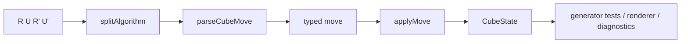

# Move Parser And State Transition

Move parsing and state transition are shared capabilities. They do not belong
only to generation or only to rendering; they are the puzzle semantics layer both
sides need.

## What The Parser Does

The parser turns text into typed moves. `Rw2` is not just text; it is a wide
turn. `(3,-2)` is a Square-1 tuple move. Clock notation such as `UR3+` carries
pin and dial meaning. The parser rejects invalid notation and turns valid
notation into structures later code can safely consume.

## What State Transition Does

State transition defines what happens when a move is applied to a puzzle state.
It is not a rendering trick and it is not only test support; it is the puzzle
behavior itself. Renderers need it to know where stickers end up, and generator
tests need it to verify output can be parsed and applied.

## Why This Is `scramble-puzzle`

If parsing lived inside the generator, renderers would need to duplicate it. If
it lived inside the renderer, generators could not independently verify their
output. `@cubekit/scramble-puzzle` keeps event metadata, parsers, states, and
puzzle definitions in one shared semantic layer.

The error boundary is shared too: a single invalid token becomes
`InvalidMoveError`, while a whole scramble application failure becomes
`InvalidScrambleError`.

Key files:

- [`packages/scramble-puzzle/src/algorithm.ts`](https://github.com/deweyou/cubekit/blob/main/packages/scramble-puzzle/src/algorithm.ts)
- [`packages/scramble-puzzle/src/cube/cube-parser.ts`](https://github.com/deweyou/cubekit/blob/main/packages/scramble-puzzle/src/cube/cube-parser.ts)
- [`packages/scramble-puzzle/src/square1/square1-state.ts`](https://github.com/deweyou/cubekit/blob/main/packages/scramble-puzzle/src/square1/square1-state.ts)
