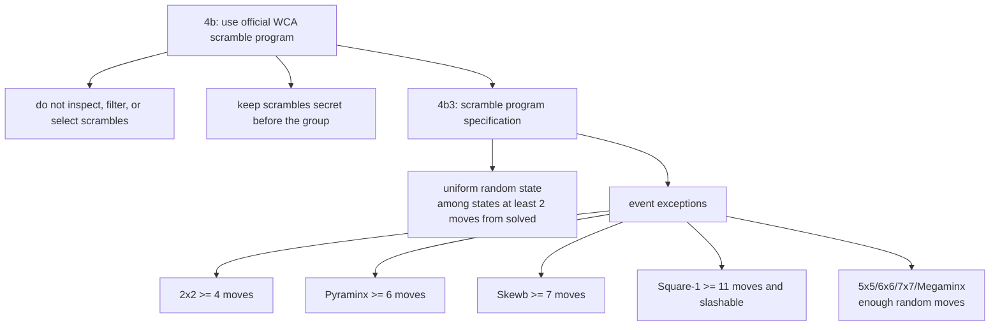

# WCA Scramble Rules

::: warning Official WCA status
CubeKit is a learning and development implementation. Official competitions must
use the current official WCA scramble program from the WCA website.
:::

The WCA rule is not "make the scramble string look random." The important
requirement is fairness over the resulting puzzle states. Regulation 4b requires
competition scrambles to come from an official program, 4b1 says generated
scrambles must not be inspected or filtered, and 4b3 defines what the program
should output.

The default 4b3 idea is: choose uniformly from states that need at least two
moves to solve, then output a sequence that reaches that state. A simple random
sequence of moves usually does not make all states equally likely, so it does
not automatically satisfy random-state fairness.

## Event Exceptions

| Event | Rule meaning | CubeKit mapping |
| --- | --- | --- |
| 2x2 | sampled state must need at least 4 moves | `generateTwoByTwoScramble` rejects too-close states |
| Pyraminx | main state must need at least 6 moves; tips are separate | `generatePyraminxScramble` filters the body, then adds tips |
| Skewb | state must need at least 7 moves | `generateSkewbScramble` filters with a solver |
| Square-1 | state must need at least 11 moves and allow an initial `/` | `generateSquareOneScramble` uses the Square-1 metric |
| 5x5/6x6/7x7/Megaminx | enough random moves instead of full random-state generation | fixed-length random-turn generators |

Blindfolded events add another requirement: the scramble sequence must randomize
the puzzle orientation. CubeKit models this with no-inspection orientation moves
for `333bld`, `444bld`, `555bld`, and `333mbld`.

## Engineering Impact

These rules mean the implementation cannot be a single "choose random moves"
function. Small random-state events need state sampling, distance filtering, and
inverse solving. Large random-turn events need fixed lengths and move-family
constraints. Image rendering also needs parseable scrambles so it can apply the
sequence to a puzzle state.

References:

- [WCA Regulation 4b3](https://www.worldcubeassociation.org/regulations/#4b3)
- [CubeKit WCA generation notes](https://github.com/deweyou/cubekit/blob/main/docs/packages/scramble-core/wca-generation-rules.md)
