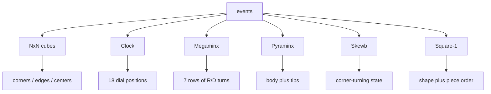

# Event Strategies



Each puzzle family needs a different scramble strategy because "state" means a
different thing for each puzzle. A 3x3 state is about corners and edges. A Clock
state is dial positions. A Square-1 state can even change shape.

## 2x2

2x2 has only corner pieces, so random-state generation is practical. The
generator samples a corner state, rejects it if it can be solved in fewer than 4
moves, and asks a 2x2 solver for an exactly shaped scramble. The output length is
stable, but the fairness still comes from the sampled state.

Closer to implementation:

```ts
solver = new TwoByTwoSolver()

repeat up to 100:
  state = {
    permutation: randomInt(5040),
    orientation: randomInt(729)
  }

  if solver.solveIn(state, 3) exists:
    continue

  return solver.generateExactly(state, 11)
```

`generateExactly(state, 11)` is still solver search. The target is not shortest
solution; the target is an exact output shape.

## 3x3, One-Handed, And Fewest Moves

3x3 and one-handed use the same random-state idea: sample a legal 3x3 cube
state, solve it with a two-phase solver, and use the inverse solution. The
solver searches within a maximum scramble length and may retry if it cannot find
a suitable answer quickly.

Fewest Moves is still a 3x3 state scramble, but it is framed for the FMC attempt
format. The implementation adds fixed padding around the generated scramble and
uses axis restrictions so the surrounding moves do not collapse into the
scramble.

3x3 sampling must satisfy physical constraints:

```ts
cornerPermutation = randomPermutation(8)
cornerParity = parity(cornerPermutation)

edgePermutation = randomPermutationWithParity(12, cornerParity)
cornerOrientation = randomCornerOrientationWithConstrainedLastCorner()
edgeOrientation = randomEdgeOrientationWithConstrainedLastEdge()

facelets = coordinatesToFacelets(...)
solution = twoPhase.solve(facelets, inverse = true)
```

FMC and blindfolded variants add first/last axis restrictions so padding or
orientation moves do not merge with the main scramble.

## 4x4 And 4x4 Blindfolded

4x4 has centers and paired edges in addition to corners, so it uses a 4x4 solver
strategy rather than the 3x3 two-phase solver. Blindfolded 4x4 starts from that
base scramble and appends orientation moves such as `x`, `y`, and `z` variants.

```ts
scramble = fourByFourSearch.randomState(random)

if event is 444bld:
  orientation = randomChoice(24 cube orientations)
  scramble = scramble + orientation
```

Those 24 orientations represent the possible ways the cube may be handed to the
competitor.

## 5x5, 6x6, 7x7, And 5x5 Blindfolded

Big cubes use random-turn generation:

| Event | Typical length in Cubegin | Main idea                   |
| ----- | ------------------------: | --------------------------- |
| 5x5   |                  60 moves | random outer and wide turns |
| 6x6   |                  80 moves | random outer and wide turns |
| 7x7   |                 100 moves | random outer and wide turns |

The generator avoids choosing the same axis back-to-back. A 5x5 blindfolded
scramble adds no-inspection orientation moves using third-layer-wide moves such
as `3Uw` or `3Rw`.

```ts
previousAxis = none

while moves.length < length:
  face = randomFace(axis != previousAxis)
  width = randomInt(1..floor(size / 2))
  suffix = randomChoice("", "2", "'")
  moves.push(format(face, width, suffix))
  previousAxis = axis(face)
```

`width = 1` is an outer turn, `width = 2` becomes a wide move such as `Rw`, and
larger widths become moves such as `3Rw`.

## Clock

Clock is not a sticker permutation puzzle. Its state is 18 dial positions: 9 on
the front and 9 on the back. A scramble chooses offsets for a first-side set of
dial groups, inserts `y2`, and then chooses offsets for a second-side set. The
renderer later draws clock hands based on those 18 positions.

```ts
firstSide = [UR, DR, DL, UL, U, R, D, L, ALL]
secondSide = [U, R, D, L, ALL]

for move in firstSide:
  emit move + randomTurnAmount(-5..6)

emit y2

for move in secondSide:
  emit move + randomTurnAmount(-5..6)
```

A token such as `UR3+` later becomes "add 3 ticks to this selected dial group."

## Megaminx

Megaminx uses the WCA random-turn exception. The scramble is written as 7 rows.
Each row alternates `R++`/`R--` and `D++`/`D--` style moves for 10 moves, then
ends with `U` or `U'`. The row format is part of what makes Megaminx scrambles
readable for humans.

```ts
for row in 0..6:
  for column in 0..9:
    side = column is even ? "R" : "D"
    direction = randomChoice("++", "--")
    emit side + direction

  emit lastDirection == "++" ? "U" : "U'"
```

Megaminx generation is about WCA-format random turns, not solving a sampled
target state.

## Pyraminx

Pyraminx separates the main body from the tips. The generator samples a body
state plus tip orientations, rejects states that are too close, then solves the
body and appends tip moves when tips are not already solved. That is why a
Pyraminx scramble may contain lowercase tip turns.

```ts
state = {
  edgePerm,
  edgeOrient,
  cornerOrient,
  tips
}

if solveIn(state, 5, includingTips = true) exists:
  reject

bodyScramble = solveBodyExactly(state, 11)
tipMoves = movesNeededForUnsolvedTips(state.tips)
return bodyScramble + tipMoves
```

Tips are visible in the final text, but they should be understood separately
from the main body search.

## Skewb

Skewb is a corner-turning puzzle. It uses a compact state model and a dedicated
solver. The generator samples a Skewb state, rejects states solvable in fewer
than 7 moves, and outputs a scramble from the accepted state.

```ts
state = {
  perm: randomInt(4320),
  twst: randomReachableTwist()
}

if solveIn(state, 6) exists:
  reject

return generateExactly(state, 11)
```

The basic move families are only `L/R/B/U`, so the move tables are compact.

## Square-1

Square-1 is shape-shifting, so its scramble is not a simple face-turn list. A
move like `(3,0)` rotates layers, while `/` slices the puzzle and changes the
shape. The generator samples a Square-1 state, solves it with a Square-1 search,
applies the result to check the state, and rejects states too close to solved.

```ts
repeat up to 100:
  randomCube = FullCube.randomCube(random)
  solution = squareOneSearch.solution(randomCube, inverse = true)
  if solution is null:
    continue

  state = apply(solution, solvedSquareOne)

  if solveSquareOneStateIn(state, 10) exists:
    continue

  return solution
```

The `apply` step matters because `/` legality depends on the current shape. The
tuple/slash text must be legal from solved state.

The key lesson: each event shares the same fairness vocabulary, but the state
model and generator strategy are puzzle-specific.
