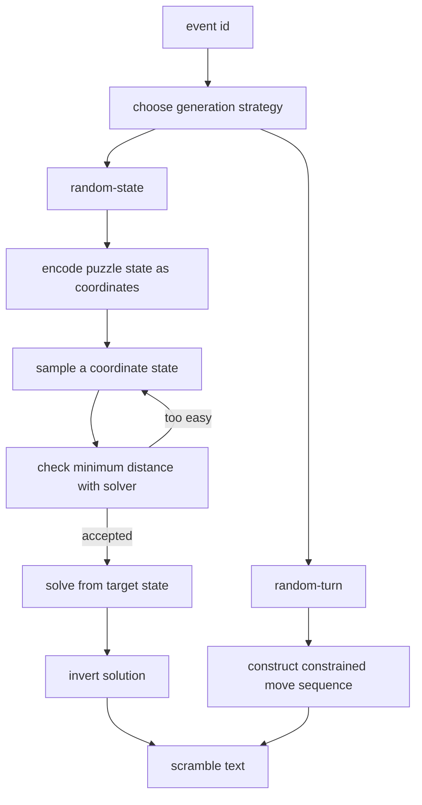

# Generation Model



The useful mental model is: **choose the target state first; write the scramble
text second.** The scramble string is only a path from solved to that target
state.

::: tip Advanced reading order
For source-level data structures, read [State Space And Coordinates](./state-space)
and then [Search And Pruning](./search-pruning). This page keeps the main thread;
those pages explain why the pseudo-code is fast enough to run.
:::

## Example: How A 2x2 Scramble Is Generated

2x2 only has corners, so the state can be encoded with two coordinates:

| State part | Meaning | Size |
| --- | --- | ---: |
| permutation | relative positions of 7 corners; the last is constrained | 5040 |
| orientation | orientations of 7 corners; the last is constrained | 729 |

The generator does not randomly concatenate `R U F` moves. It does this:

```ts
for attempt in 0..99:
  state = random2x2State()

  // WCA: 2x2 must require at least 4 moves.
  if solveIn(state, maxDepth = 3) exists:
    continue

  // Find an 11-move path from solved to this state.
  return generateExactly(state, length = 11)

throw "could not generate"
```

The important call is `solveIn(state, 3)`. It is not producing the final
scramble. It is asking whether the sampled state is too easy. If the state can
be solved in 3 moves or fewer, it is rejected.

## Move Tables: Precompute What A Move Does

Solvers repeatedly ask: if the current state is `X`, where does move `m` take
us?

Instead of moving pieces every time, the solver precomputes tables:

```ts
movePerm[permutation][move] = nextPermutation
moveOrient[orientation][move] = nextOrientation
```

For 2x2, the search uses `U`, `R`, and `F`, each with three turn amounts, so
there are 9 moves. A move table is a map of the state graph: states are nodes,
moves are edges.

For the deeper coordinate story, see [State Space And Coordinates](./state-space).

## Pruning Tables: Know A Lower Bound Quickly

The solver also builds "how far from solved must this coordinate be?" tables.
They are built by breadth-first search from solved:

```ts
pruning[solved] = 0

for depth = 0, 1, 2, ...
  for each state whose pruning value is depth:
    for each move:
      next = applyMove(state, move)
      if pruning[next] is unknown:
        pruning[next] = depth + 1
```

During search:

```ts
if pruning[currentState] > remainingDepth:
  stop searching this branch
```

That is why `solveIn(state, 3)` can efficiently answer whether a state is within
three moves of solved.

For the deeper search story, see [Search And Pruning](./search-pruning).

## Why The Inverse Solution Is A Scramble

If the sampled target state is `T`, the solver finds a solution:

```text
T --A B C--> solved
```

Reverse the order and invert each move:

```text
solved --C' B' A'--> T
```

That inverse path is the scramble. It is not arbitrary text; it is the route to
the sampled target state.

## 3x3: Why Two-Phase Search Is Used

3x3 state is much larger. It is usually described by:

| Coordinate | Meaning |
| --- | --- |
| corner permutation | corner positions |
| corner orientation | corner twists |
| edge permutation | edge positions |
| edge orientation | edge flips |

Sampling those numbers must respect real cube constraints: corner and edge
permutation parity must match, corner twists must sum correctly, and edge flips
must sum correctly.

After sampling a legal state, a two-phase solver searches for a solution:

1. Phase 1 moves the cube into a more restricted intermediate group.
2. Phase 2 solves the cube inside that group.

The generator receives a solution from target state to solved state, then emits
the inverse path as the scramble.

## Axis Restrictions

Some events add moves around the base scramble. Fewest Moves has padding;
blindfolded events add orientation moves. If the first or last move of the main
scramble shares an axis with those surrounding moves, the string can collapse or
look malformed.

So the generator may require:

```ts
first move must not collide with prefix axis
last move must not collide with suffix/orientation axis
```

If a solver answer violates the restriction, the generator retries. This is a
format and event-rule concern; it does not change the random-state target.

## Random-Turn Generation

For 5x5, 6x6, and 7x7, full random-state generation is too expensive. The WCA
allows sufficiently many random moves, so the algorithm builds a constrained
sequence:

```ts
while moves.length < requiredLength:
  face = chooseFace(axis != previousAxis)
  width = chooseLayerWidth(size)
  suffix = choose("", "2", "'")
  moves.push(face + width + suffix)
  previousAxis = axis(face)
```

| Event | Length |
| --- | ---: |
| 5x5 | 60 |
| 6x6 | 80 |
| 7x7 | 100 |

Megaminx is also random-turn, but it uses a readable 7-row format that
alternates `R` and `D` moves and ends each row with `U` or `U'`.

## Square-1

Square-1 is shape-shifting. A state includes both piece order and shape, and a
slash is only legal for some shapes. The generator roughly does:

```ts
for attempt in 0..99:
  randomState = randomSquare1State()
  solution = solveSquare1(randomState)
  if no solution:
    continue

  scramble = inverse(solution)
  state = apply(scramble, solvedSquare1)

  if solveIn(state, maxDepth = 10) exists:
    continue

  return scramble
```

The extra `apply` step confirms that the tuple/slash sequence legally reaches a
valid Square-1 state and satisfies the 11-move minimum.

## Clock

Clock has no sticker permutation. Its state is 18 dial positions. The scramble
chooses offsets for dial groups:

```text
UR DR DL UL U R D L ALL
y2
U R D L ALL
```

Tokens such as `UR3+` rotate a dial group by 3 ticks. `y2` flips to the other
side.

## Summary

| Type | Used by | Core logic |
| --- | --- | --- |
| random-state | 2x2, 3x3, 4x4, Pyraminx, Skewb, Square-1, and related events | sample state, reject too-easy states, solve, invert |
| random-turn | 5x5, 6x6, 7x7, Megaminx, Clock | construct a long or fixed-format random move sequence |

The real algorithm answers three questions:

1. How is this puzzle state represented?
2. How do we reject states that are too easy or illegal?
3. How do we convert the accepted state into human-readable scramble text?
