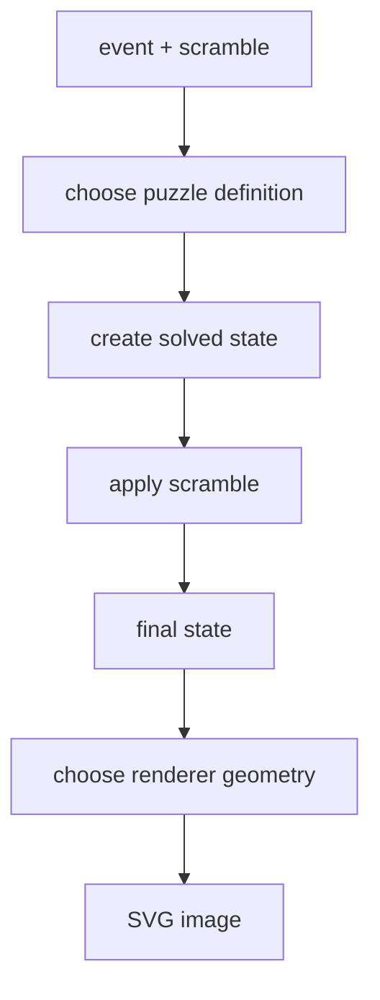

# Scramble Image Rendering



A scramble image is generated from the final state, not from the scramble text.
The renderer does not ask "what moves are in the string?" It asks "what does the
puzzle look like after these moves?"

## Shared Pipeline

Every event follows the same high-level pipeline:

1. Use the event id to choose the puzzle family.
2. Create a solved state for that puzzle.
3. Parse and apply the scramble to get the final state.
4. Choose the renderer for that puzzle family.
5. Serialize the drawing as SVG.

SVG is a good output format because it is deterministic, text-based, scalable,
and easy to test.

## Renderer Shapes

| Puzzle family | Image idea |
| --- | --- |
| NxN cubes | unfolded cube net with one square per sticker |
| Clock | two circular faces, 18 clock hands, and visible pins |
| Megaminx | flattened pentagonal faces arranged for readability |
| Pyraminx | triangular faces with smaller tip pieces |
| Skewb | square/diamond-like face layout matching its sticker geometry |
| Square-1 | top and bottom layers drawn with shape-shifting piece arcs |

The layout is puzzle-specific, but the input is always the same kind of thing:
a validated final state.

## Cube Nets: State To Rectangles

NxN cube images are usually drawn as unfolded nets:

```text
        U
    L   F   R   B
        D
```

For every sticker, the renderer emits one SVG rectangle:

```ts
for face in faces:
  origin = faceOrigin(face)

  for row in 0..size-1:
    for col in 0..size-1:
      color = state.stickers[face][row][col]
      drawRect(
        x = origin.x + col * stickerSize,
        y = origin.y + row * stickerSize,
        fill = color
      )
```

The scramble string is no longer relevant at this point. `state.stickers`
already contains the final color distribution after applying the scramble.

## Clock: Dial Position To Hand Angle

Clock state is 18 numbers in `0..11`. Each value becomes an angle:

```ts
angle = position * 30deg
```

The renderer draws two large faces, nine small dials per side, rotated hands,
pins, and top tick marks. `rightSideUp` affects front/back color and hand
interpretation. The `y2` move has already swapped sides during state transition.

## Square-1: Piece Arcs Instead Of A Grid

Square-1 cannot be drawn as a regular grid. The renderer walks the top and
bottom layer piece order and draws arcs:

```ts
angle = startAngle

for piece in topLayer:
  span = piece is corner ? 60deg : 30deg
  drawArc(center, innerRadius, outerRadius, angle, angle + span)
  angle += span
```

Corner pieces occupy 60 degrees; edge pieces occupy 30 degrees. The `/` move
changes which pieces belong to each layer and therefore changes the shape that
gets drawn.

## Why SVG String Output

SVG string output keeps the boundary clear:

```text
state -> SvgNode tree -> serialized SVG string
```

The renderer does not need DOM or canvas. Tests can inspect `viewBox`,
`rect/path/circle` counts, and colors. Browser callers can inject the string,
and downloads can wrap it in a Blob.

## Why The Image Can Validate The Scramble

Rendering has a useful side effect. If a scramble cannot be parsed or cannot be
legally applied, the renderer cannot reach a final state. That makes image
generation a practical smoke test for the generator: a valid generator should
produce text that the state layer can apply and the renderer can draw.

## What The Renderer Does Not Decide

The renderer does not decide whether a scramble is fair. Fairness belongs to the
generator and WCA rules. The renderer only visualizes the state produced by a
given event and scramble. This separation keeps the mental model clean:

- generation answers "which state should we reach?";
- state transition answers "what state does this text reach?";
- rendering answers "how should that state be drawn?"
