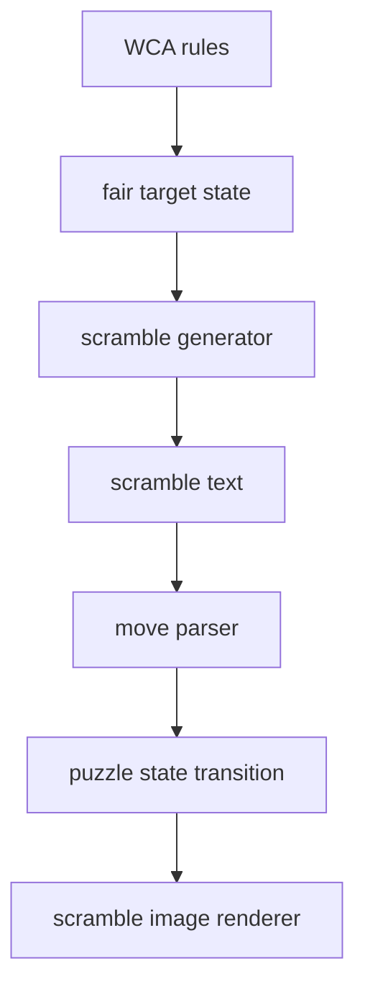

# WCA Scramble Generation And Scramble Images

::: warning Official WCA status
CubeKit is an educational implementation, not an official WCA scramble program.
Official competitions must use the current official program published by the
World Cube Association.
:::

This site explains how WCA-style scrambles and scramble images are produced. It
is a learning document, not an API manual. The main idea is simple: a scramble
string is only the visible output. Behind it there is a choice of target state,
a rule for avoiding trivial states, a solver or random-turn strategy, and a
state model that can later be drawn as an image.

## Learning Path

1. Start with [Rules And Fairness](./wca-rules) to understand why "random-looking
   moves" are not enough.
2. Read [Generation Model](./generation) to learn the shared pipeline used by
   random-state and random-turn scrambles.
3. Read [State Space And Coordinates](./state-space) to see why puzzle states can
   be encoded as numbers.
4. Read [Search And Pruning](./search-pruning) to understand how solvers filter
   and solve states efficiently.
5. Read [Event Strategies](./event-families) to see how each WCA puzzle family
   uses that model.
6. Read [State Transition](./state-transition) to connect notation to actual
   puzzle state.
7. Finish with [Scramble Image Rendering](./image-rendering) to see why images
   are generated from state, not from raw text.

## What To Keep In Mind

- Fairness belongs to the final puzzle state, not to the text length.
- Small puzzles can often be generated by sampling a state and solving it
  backwards.
- Large puzzles often use carefully constrained random-turn sequences because
  fully uniform random-state generation is too expensive.
- A scramble image is a second computation: parse the text, apply the moves,
  then draw the resulting state.

## Sources

- [WCA Regulations, Article 4](https://www.worldcubeassociation.org/regulations/#article-4-scrambling)
- [WCA official scrambles page](https://www.worldcubeassociation.org/regulations/scrambles/)
- [thewca/tnoodle-lib](https://github.com/thewca/tnoodle-lib)
- [CubeKit TNoodle notes](https://github.com/deweyou/cubekit/blob/main/docs/tnoodle-implementation-notes.md)
