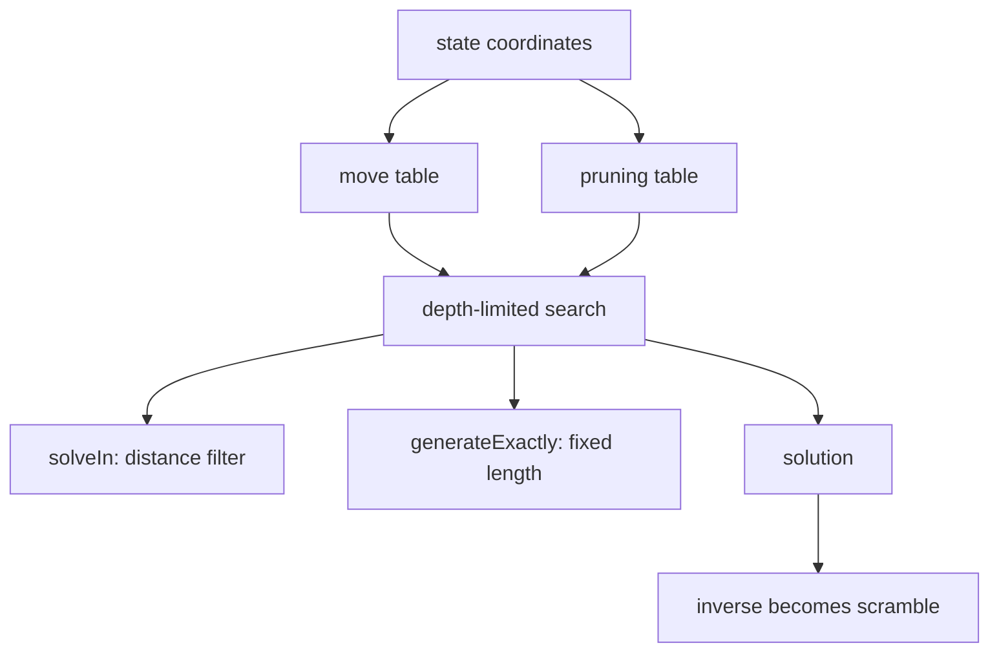
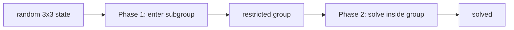

# Search And Pruning



This page answers the deeper question: **how can a solver search huge state
spaces quickly enough to generate scrambles?**

The two core tools are move tables and pruning tables.

## Move Tables

Suppose a 2x2 state is:

```ts
state = {
  permutation: 1234,
  orientation: 321,
};
```

After an `R` move, what are the new coordinates? A slow solver could unpack
pieces, rotate them, and encode them again. A scramble solver does this millions
of times, so it precomputes:

```ts
movePerm[1234][R] = 3051;
moveOrient[321][R] = 117;
```

Then a move is just array lookup:

```ts
next = {
  permutation: movePerm[state.permutation][move],
  orientation: moveOrient[state.orientation][move],
};
```

This is the adjacency list of the state graph.

## Pruning Tables

Move tables tell us where we can go. Pruning tables tell us which branches are
impossible to finish within the remaining depth.

They are built from solved state:

```ts
prun[solved] = 0
frontier = [solved]

while frontier not empty:
  state = frontier.pop()
  for move in moves:
    next = applyMoveByTable(state, move)
    if prun[next] is unknown:
      prun[next] = prun[state] + 1
      frontier.push(next)
```

If `prun[x] = 5`, then coordinate `x` is at least 5 moves away from solved, or
at least 5 moves away in that coordinate projection.

For 2x2 there are separate permutation and orientation pruning tables:

```ts
lowerBound = max(
  prunPerm[current.permutation],
  prunOrient[current.orientation]
)

if lowerBound > remainingDepth:
  prune
```

This is a lower bound, not a guess.

## `solveIn`: Filtering Too-Easy States

WCA minimum-distance filters usually look like:

```ts
isTooClose = solver.solveIn(state, minimumDistance - 1) !== null;
```

For 2x2, the minimum is 4, so the generator asks whether a 3-move solution
exists:

```ts
if solveIn(state, 3) exists:
  reject state
```

`solveIn` searches from depth 0 up to the max:

```ts
for length in 0..maxLength:
  if depthLimitedSearch(state, length):
    return solution
return null
```

If it returns `null`, the state passed the minimum-distance filter.

## `generateExactly`: Fixed-Length Scrambles

Some small-puzzle scrambles use a stable fixed output length. The solver is not
asking for the shortest solution; it is asking for a path of exactly the desired
length:

```ts
solution = search(state, desiredLength, (exactLength = true));
```

Fairness still comes from state sampling and distance filtering. Fixed length is
about output shape and compatibility.

## Depth-Limited Search With Pruning

The search is often depth-first with a depth limit:

```ts
function search(state, depth, lastMove):
  if depth == 0:
    return isSolved(state)

  if lowerBound(state) > depth:
    return false

  for move in allowedMoves:
    if move conflicts with lastMove:
      continue
    next = applyMoveByTable(state, move)
    if search(next, depth - 1, move):
      record move
      return true

  return false
```

The outer loop increases depth:

```ts
for depth = minPossibleDepth..maxDepth:
  if search(state, depth):
    return solution
```

This is the intuition behind IDA\*: memory stays close to DFS, while pruning
tables keep the search from exploding.

## 3x3 Two-Phase Search

3x3 is too large for a simple direct search. Two-phase search splits the job:



Phase 1 does not solve the cube. It moves the cube into a restricted group.
Phase 2 solves it there. Each phase has its own coordinates and pruning tables,
which makes the total search practical.

The generator receives:

```text
target --phase1 moves + phase2 moves--> solved
```

and emits the inverse.

## Square-1 Two-Phase Search

Square-1 is also two-phase, but because of shape:

1. Phase 1 uses `(a,b)` turns and `/` slices to reach a regular shape space.
2. Phase 2 solves edge/corner permutation and middle layer in that space.

Slash legality depends on current shape, so Square-1 search also has to check
whether each successor is legal.

## Where Randomness Lives

The solver search itself is not always random. Randomness mainly comes from:

- sampling the target state;
- shuffling move order when several moves are possible;
- directly choosing face, width, and suffix in random-turn events.

For random-state events, the first point is the fairness anchor.

## Three Layers To Remember

```text
WCA rule layer
  - minimum distance, event exceptions, blindfolded orientation

state sampling layer
  - coordinate encoding, legal sampling, physical constraints

solver layer
  - move tables, pruning tables, search, inverse solution
```

With those layers in mind, each event generator becomes much easier to read.
