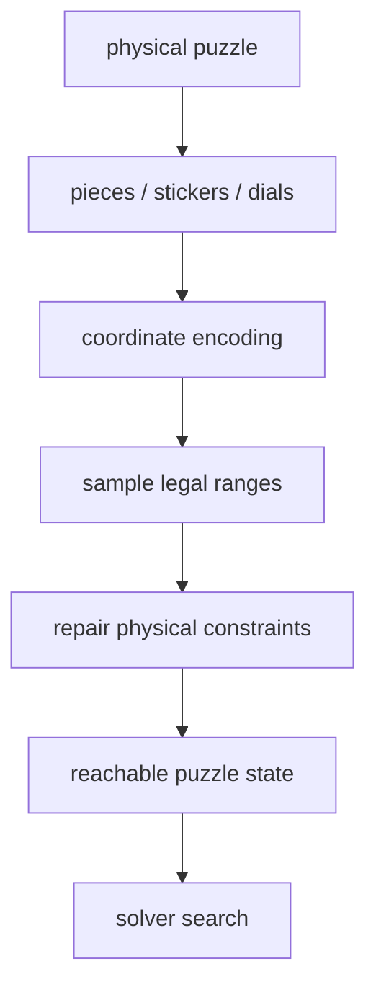

# State Space And Coordinates



Random-state generation starts with a practical question: **how can a physical
puzzle state be represented as numbers that can be sampled and searched?**

Solvers usually do not carry a full visual puzzle around. They compress state
into coordinates. Good coordinates are small enough to search, but rich enough
that different important states do not collapse into one value.

## Solver State Is Not Rendering State

| State type | Main use | Example |
| --- | --- | --- |
| solver coordinates | search, tables, pruning | `permutation = 1234`, `orientation = 321` |
| rendering state | drawing the final puzzle | sticker colors or Clock hand positions |

Scramble generation mostly uses solver coordinates. Scramble images mostly use
rendering state. They are related, but optimized for different jobs.

## 2x2: Corner Coordinates

2x2 only has corners. TNoodle-style 2x2 search fixes one reference corner, so it
encodes the remaining 7 corners:

| Coordinate | Size | Why |
| --- | ---: | --- |
| `permutation` | `7! = 5040` | positions of 7 corners |
| `orientation` | `3^6 = 729` | 6 corner twists are free; the last is constrained |

Orientation is `3^6`, not `3^7`, because a real 2x2 cannot twist corners with an
arbitrary total orientation. Once six corner orientations are known, the last is
forced by the physical constraint.

Conceptually:

```ts
permutation = randomInt(5040)
orientation = randomInt(729)
state = { permutation, orientation }
```

The solver then uses these two numbers to index move tables and pruning tables.

## 3x3: Sampling Must Respect Cube Physics

3x3 state is usually split into four coordinates:

| Coordinate | Meaning | Constraint |
| --- | --- | --- |
| corner permutation | corner positions | parity must match edge permutation |
| edge permutation | edge positions | parity must match corner permutation |
| corner orientation | corner twists | total twist must be legal |
| edge orientation | edge flips | total flip must be legal |

Many arbitrary combinations of those numbers cannot exist on a real cube. For
example, swapping only two corners is impossible by legal moves.

So random 3x3 state generation does something like:

```ts
cornerPerm = randomPermutation(8)
cornerParity = parity(cornerPerm)

edgePerm = randomPermutationWithParity(12, cornerParity)
cornerOrientation = randomOrientation(base = 3, lastValueConstrained = true)
edgeOrientation = randomOrientation(base = 2, lastValueConstrained = true)
```

Parity is the even/odd character of a permutation. Real 3x3 states require
corner and edge permutation parity to agree.

## Pyraminx: Body And Tips

Pyraminx state can be split into:

| Coordinate | Meaning |
| --- | --- |
| `edgePerm` | edge permutation |
| `edgeOrient` | edge orientation |
| `cornerOrient` | main corner orientation |
| `tips` | four tip orientations |

The WCA distance rule is about the main state. Tips are visible moves added
afterward, so the generator can sample tips while checking the body distance
separately.

## Skewb: Compact Corner-Turning Coordinates

Skewb search uses two compact coordinates:

| Coordinate | Size | Meaning |
| --- | ---: | --- |
| `perm` | 4320 | combined center/corner permutation encoding |
| `twst` | 2187 | corner orientation |

The search uses four basic move families: `L`, `R`, `B`, and `U`. The state space
is small enough for move and pruning tables.

## Square-1: Shape Is Part Of State

Square-1 is shape-shifting, so state includes more than piece order:

```text
top layer shape
bottom layer shape
top/bottom piece order
middle layer position
slashability
```

Square-1 search is usually split into phases:

1. Phase 1 handles shape and gets the puzzle into a more regular space.
2. Phase 2 solves piece permutation inside that regular shape.

That is why Square-1 notation uses `(a,b)` turns and `/` slices instead of
ordinary cube face turns.

## Clock: 18 Numbers, Not Pieces

Clock has no sticker permutation. Its state is dial positions:

```ts
positions = [
  front0, front1, ..., front8,
  back0, back1, ..., back8
]
```

Each value is `0..11`, the number of ticks away from 12 o'clock. `y2` swaps the
front and back sides, and Clock turn moves add offsets to selected dial groups.

## Why This Matters

Search and pruning rely on coordinates:

- move tables need `coordinate + move -> next coordinate`;
- pruning tables need "how many moves away from solved is this coordinate?";
- random-state generators need legal sampling;
- renderers eventually apply scramble text back into a visual state.

If state encoding is wrong, fast search does not help.
