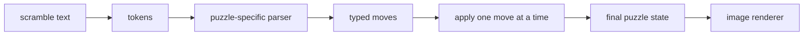

# State Transition

State transition is the bridge between a scramble string and a real puzzle
state. Without it, the system would only know text. With it, the system can ask:
"If I apply this sequence to a solved puzzle, where does every sticker, dial, or
piece end up?"

## Parsing Is Not Just Splitting Text

Different puzzles have different notation. A cube move like `Rw2` means a wide
turn. A Megaminx move like `R++` means a two-step turn in a fixed direction. A
Square-1 token like `(3,-2)` is a pair of layer rotations, while `/` is the
slice. Clock moves contain a dial group, a number, and a direction.

The parser turns those strings into structured moves so later code does not have
to guess what a token means.

## Applying Moves

Applying a move means producing a new state from the old one:

- cube-family states move stickers or cubies across faces;
- Clock states update dial positions modulo 12 and flip sides on `y2`;
- Pyraminx and Skewb states rotate triangular or corner-turning pieces;
- Square-1 states update both piece order and shape.

The state model also validates illegal moves. For example, a Square-1 `/` is
only legal when the current shape can be sliced.

## Why Images Depend On State

A renderer should not draw `R U R'` as text. It should draw the puzzle after
those moves have happened. That is why the image pipeline first parses and
applies the scramble, then renders the resulting state. The same state transition
layer also catches invalid scrambles before the image is built.

## A Small Example

For a 3x3 scramble:

1. Start with a solved cube state.
2. Parse `R U` into two cube moves.
3. Apply `R`, moving stickers around the right face and adjacent strips.
4. Apply `U`, moving stickers around the top face.
5. Render the final sticker positions as a cube net.

This is the same idea for every puzzle, even when the geometry is very
different.
