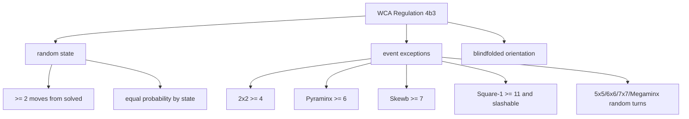

# Rules And Fairness



The WCA rule is state-based. A scramble program should not merely print a string
that looks noisy; it should make the final puzzle state fair. In the current WCA
Regulations version dated April 1, 2026, Regulation 4b3 describes a random state
from states that require at least two moves to solve, with equal probability for
each state. It then lists the event-specific exceptions.

That distinction matters. If we choose `R`, `U`, and `F` moves at random for a
fixed length, some states are reached by many different strings while others are
reached by fewer strings. Equal probability over strings is not the same thing
as equal probability over states.

## Distance Filters

A distance filter removes states that are too close to solved. For a beginner it
helps to think of it as "do not accidentally hand out a nearly solved puzzle."
For the generator it is stricter: after a state is sampled, a solver checks
whether the state can be solved within the forbidden distance. If it can, the
state is rejected and a new one is sampled.

| Event family             | Rule idea                                 | Generator idea                                                        |
| ------------------------ | ----------------------------------------- | --------------------------------------------------------------------- |
| Most random-state events | at least 2 moves from solved              | sample state, reject trivial states, solve backwards                  |
| 2x2                      | at least 4 moves                          | random corner state plus 2x2 solver filter                            |
| Pyraminx                 | at least 6 moves                          | filter the main Pyraminx state; tips are handled as visible tip moves |
| Skewb                    | at least 7 moves                          | random Skewb state plus Skewb solver filter                           |
| Square-1                 | at least 11 moves and initially slashable | random Square-1 state plus Square-1 metric filter                     |
| 5x5, 6x6, 7x7, Megaminx  | sufficiently many random moves            | constrained random-turn sequence                                      |

## Turning The Rule Into An Algorithm

Regulation 4b3 becomes this loop for random-state events:

```ts
while true:
  targetState = sampleUniformStateForThisPuzzle()

  // For 2x2 the minimum is 4, so check whether 3 moves are enough.
  if solver.canSolveWithin(targetState, minimumDistance - 1):
    continue

  solution = solver.solve(targetState)
  return inverse(solution)
```

There are three different jobs here:

1. `sampleUniformStateForThisPuzzle` samples a puzzle state, not a move string.
2. `canSolveWithin` is the rule filter: it only asks whether the state is too
   easy.
3. `inverse(solution)` is the human-readable scramble finally given to the
   competitor.

For random-turn exceptions, the loop is replaced by a constrained move sequence.
That is why 5x5/6x6/7x7 and Megaminx do not look like 2x2 or 3x3 internally.

## Blindfolded Orientation

Blindfolded events add another fairness concern: puzzle orientation. If a puzzle
is always handed to the competitor in the same orientation, the scramble state is
not fully randomized for blindfolded solving. A TNoodle-style generator appends
orientation moves such as cube rotations or wide moves so that orientation is
also random.

Multi-blind is the same idea repeated: each cube receives its own 3x3
blindfolded scramble. It should be read as many scramble lines, not one giant
ordinary 3x3 scramble.

References:

- [WCA Regulation 4b3](https://www.worldcubeassociation.org/regulations/#4b3)
- [WCA official scrambles page](https://www.worldcubeassociation.org/regulations/scrambles/)
