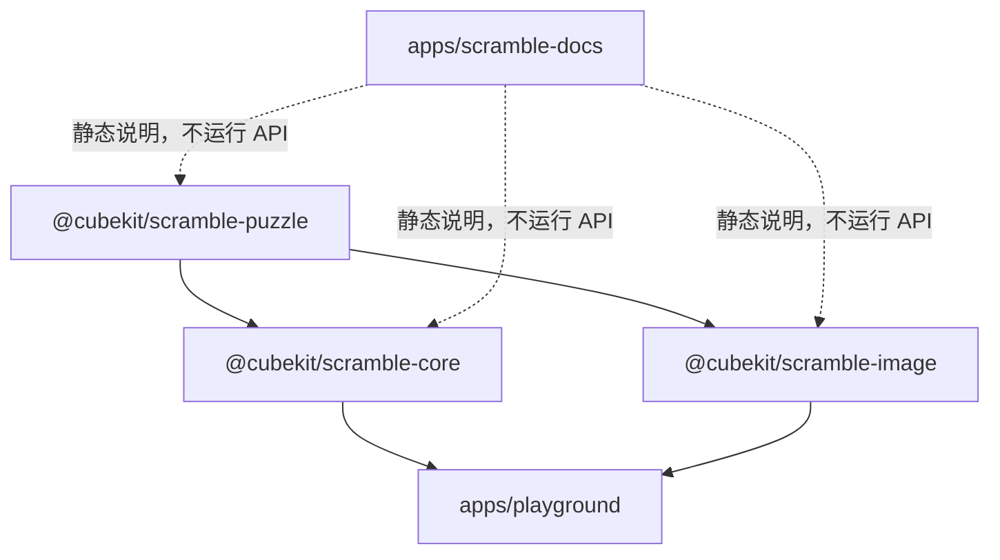

# CubeKit 包边界



CubeKit 把 TNoodle-compatible 能力拆成三个包，是为了让语义、生成和渲染各自独立测试。

## `scramble-puzzle`

这个包拥有 WCA event metadata、move parser、state transition 和 puzzle definition。它回答的问题是：「这串记号是什么意思？应用后 puzzle 状态是什么？」

## `scramble-core`

这个包拥有随机源、事件分发、求解器和各事件生成规则。它回答的问题是：「给定一个 WCA event，如何生成一条符合规则的 scramble？」

## `scramble-image`

这个包拥有 SVG builder 和 puzzle-specific renderers。它回答的问题是：「给定 event 和 scramble，最终应该画出什么状态？」

## 验证策略

三包都有 package-local 单测和 coverage 阈值。覆盖重点不是每个 private 分支都硬测，而是 WCA 合约、parser/state 行为、生成器边界和 SVG 输出形状。

常用命令：

```bash
pnpm --filter @cubekit/scramble-puzzle test:coverage
pnpm --filter @cubekit/scramble-core test:coverage
pnpm --filter @cubekit/scramble-image test:coverage
pnpm --filter playground build
```

后续如果要把生产 app 切到新三包，应该单独设计 worker/runtime 方案。本学习站只讲原理，不承担交互验证；交互验证继续由 `apps/playground` 承担。

更多资料：

- [scramble-puzzle README](https://github.com/deweyou/cubekit/blob/main/packages/scramble-puzzle/README.md)
- [scramble-core README](https://github.com/deweyou/cubekit/blob/main/packages/scramble-core/README.md)
- [scramble-image README](https://github.com/deweyou/cubekit/blob/main/packages/scramble-image/README.md)
