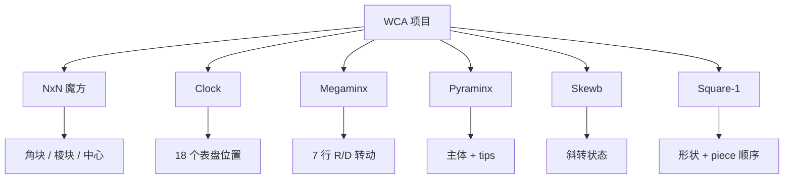

# 各项目打乱策略



每类 puzzle 的「状态」不一样，所以生成策略也不一样。3x3 的状态是角块和棱块；Clock 的状态是表盘指针；Square-1 甚至会改变形状。

## 2x2

2x2 只有角块，状态空间相对小，所以适合 random-state。生成器会随机抽角块状态，若它能在少于 4 步内复原就拒绝；通过过滤后，再用 2x2 求解器生成指定形态的打乱。输出长度稳定，但公平性来自被抽中的状态。

更接近实现的流程是：

```ts
solver = new TwoByTwoSolver()

repeat up to 100:
  state = {
    permutation: randomInt(5040),
    orientation: randomInt(729)
  }

  if solver.solveIn(state, 3) exists:
    continue

  return solver.generateExactly(state, 11)
```

这里 `generateExactly(state, 11)` 内部仍然是求解搜索，只是目标不是最短，而是正好 11 步。它会用 move table 推进状态，用 pruning table 判断剩余步数是否足够。

## 3x3、单手与最少步

3x3 和单手使用同一类 random-state 思路：抽一个合法 3x3 状态，用 two-phase solver 求解，再把解反过来作为打乱。求解器会在最大长度内搜索；若短时间内找不到合适答案，就重试。

最少步仍然是 3x3 状态打乱，但它要适配 FMC 赛制。实现会在生成打乱前后加入固定 padding，并用轴限制避免 padding 和主体打乱互相抵消。

3x3 的抽样步骤比 2x2 多了物理约束：

```ts
cornerPermutation = randomPermutation(8)
cornerParity = parity(cornerPermutation)

edgePermutation = randomPermutationWithParity(12, cornerParity)
cornerOrientation = randomCornerOrientationWithConstrainedLastCorner()
edgeOrientation = randomEdgeOrientationWithConstrainedLastEdge()

facelets = coordinatesToFacelets(...)
solution = twoPhase.solve(facelets, inverse = true)
```

`inverse = true` 的意思是让求解器直接返回「从 solved 到目标状态」方向的序列，或者等价地把普通解反向输出。FMC 和盲拧会再给搜索加首尾轴限制，避免和 padding / orientation move 合并。

## 4x4 与 4x4 盲拧

4x4 除了角块和棱块，还有中心和配对棱，因此不能直接套 3x3 two-phase。它使用 4x4 的求解策略生成随机状态打乱。4x4 盲拧会在基础打乱后追加 `x`、`y`、`z` 这类随机定向 move。

4x4 的难点是中心块和棱配对。实现上会用 4x4 专用搜索把随机 4x4 状态转成打乱文本：

```ts
scramble = fourByFourSearch.randomState(random)

if event is 444bld:
  orientation = randomChoice(24 cube orientations)
  scramble = scramble + orientation
```

这里的 24 个 orientation 可以理解为「把 cube 交给选手时的随机朝向」。

## 5x5、6x6、7x7 与 5x5 盲拧

大阶魔方走 random-turn：

| 项目 | CubeKit 中的典型长度 | 主要思路 |
| --- | ---: | --- |
| 5x5 | 60 moves | 随机外层和宽层转动 |
| 6x6 | 80 moves | 随机外层和宽层转动 |
| 7x7 | 100 moves | 随机外层和宽层转动 |

生成时会避免连续选择同一轴。5x5 盲拧会额外追加 no-inspection orientation moves，例如 `3Uw`、`3Rw` 这类三层宽转。

大阶 random-turn 的核心循环非常直接：

```ts
previousAxis = none

while moves.length < length:
  face = randomFace(axis != previousAxis)
  width = randomInt(1..floor(size / 2))
  suffix = randomChoice("", "2", "'")
  moves.push(format(face, width, suffix))
  previousAxis = axis(face)
```

`width = 1` 时是外层转，`width = 2` 时写成 `Rw` 这类宽层转，`width >= 3` 时写成 `3Rw` 这类多层宽转。

## Clock

Clock 不是贴纸置换 puzzle，它的状态是 18 个表盘位置：正面 9 个、背面 9 个。打乱先为第一面的一组表盘组合选择偏移量，再加入 `y2` 翻面，最后为第二面选择偏移量。打乱图会根据这 18 个位置画指针。

生成器并不需要求解器：

```ts
firstSide = [UR, DR, DL, UL, U, R, D, L, ALL]
secondSide = [U, R, D, L, ALL]

for move in firstSide:
  emit move + randomTurnAmount(-5..6)

emit y2

for move in secondSide:
  emit move + randomTurnAmount(-5..6)
```

`UR3+` 这类 token 会在状态转换阶段映射到「哪些表盘一起加 3」。

## Megaminx

Megaminx 使用 WCA 允许的 random-turn 例外。打乱写成 7 行；每行交替生成 `R++`/`R--` 与 `D++`/`D--` 风格的 10 个 move，最后用 `U` 或 `U'` 收尾。这个行格式让打乱既随机，也方便人工照着打。

伪代码：

```ts
for row in 0..6:
  for column in 0..9:
    side = column is even ? "R" : "D"
    direction = randomChoice("++", "--")
    emit side + direction

  emit lastDirection == "++" ? "U" : "U'"
```

Megaminx 的重点不是「求一个目标状态」，而是生成符合 WCA 格式的足量随机转动。

## Pyraminx

Pyraminx 要区分主体和 tips。生成器会抽主体状态和 tip 朝向，拒绝太接近 solved 的状态，然后求解主体；若 tips 没有复原，就追加小写 tip move。因此 Pyraminx 打乱里可能出现 `u`、`l`、`r`、`b` 这类小写 move。

更细一点：

```ts
state = {
  edgePerm,
  edgeOrient,
  cornerOrient,
  tips
}

if solveIn(state, 5, includingTips = true) exists:
  reject

bodyScramble = solveBodyExactly(state, 11)
tipMoves = movesNeededForUnsolvedTips(state.tips)
return bodyScramble + tipMoves
```

实现里 tips 会影响最终可见文本，但主体距离和 tips 的处理要分开理解。

## Skewb

Skewb 是斜转 puzzle。它有自己的紧凑状态模型和专门求解器。生成器会抽 Skewb 状态，拒绝少于 7 步可解的状态，然后从通过过滤的状态生成打乱。

Skewb 和 2x2 的形态很像：

```ts
state = {
  perm: randomInt(4320),
  twst: randomReachableTwist()
}

if solveIn(state, 6) exists:
  reject

return generateExactly(state, 11)
```

因为基本 move 只有 `L/R/B/U` 四类，move table 很小，剪枝效果也很直接。

## Square-1

Square-1 会变形，所以它的打乱不是普通 face-turn list。`(3,0)` 这种 move 表示上下层转动，`/` 表示切开并改变形状。生成器会抽 Square-1 状态，用 Square-1 search 求解，再把结果应用回状态检查距离，拒绝太接近 solved 的状态。

Square-1 的流程最容易看漏 `apply` 这一步：

```ts
repeat up to 100:
  randomCube = FullCube.randomCube(random)
  solution = squareOneSearch.solution(randomCube, inverse = true)
  if solution is null:
    continue

  state = apply(solution, solvedSquareOne)

  if solveSquareOneStateIn(state, 10) exists:
    continue

  return solution
```

为什么要求 `apply`？因为 Square-1 的 `/` 是否合法依赖当前形状。输出的 tuple/slash 文本必须真的能从 solved 状态一步步走出来。

核心结论：各项目共享同一套公平性语言，但状态模型和生成策略必须按 puzzle 设计。
