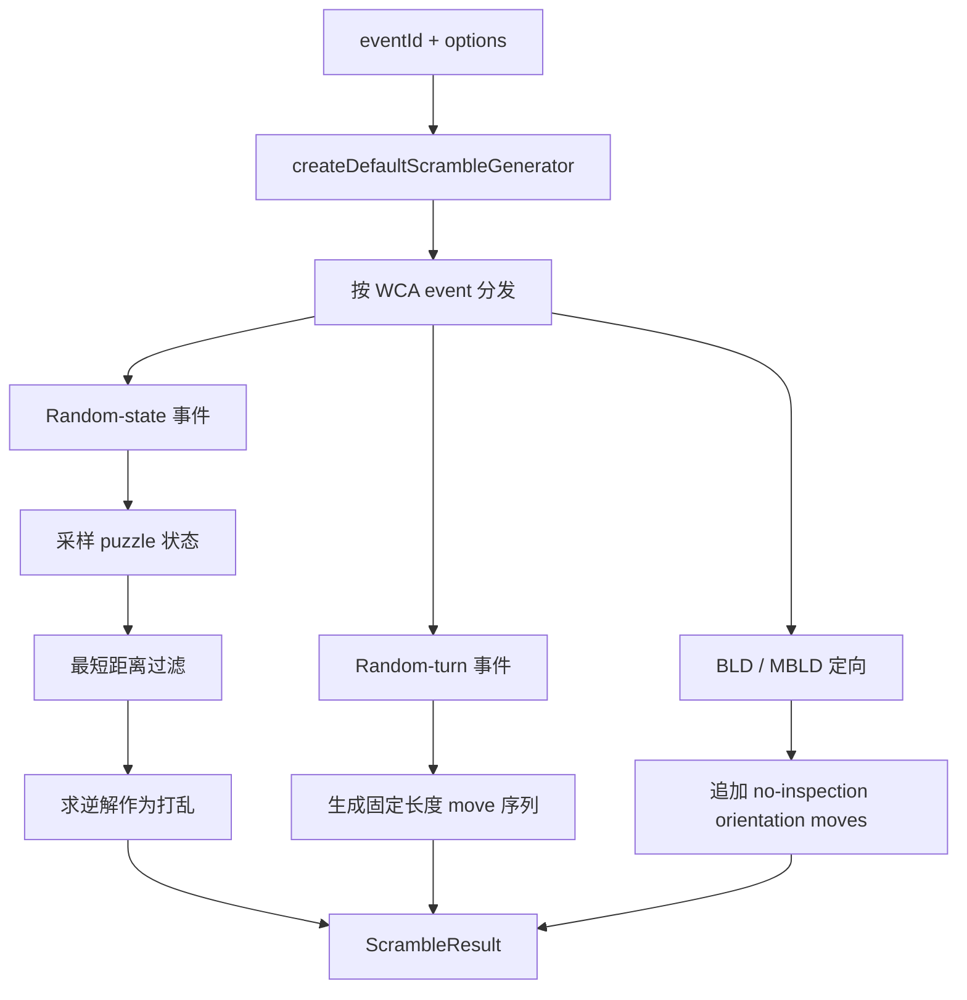

# 打乱生成原理

`@cubekit/scramble-core` 的入口是 generator facade。调用方给出 `eventId`，默认生成器把事件分发到对应的实现：3x3 走 min2phase，4x4 走 threephase，Square-1 走 sq12phase，2x2/Pyraminx/Skewb 使用专门求解器，5x5/6x6/7x7/Megaminx/Clock 走 random-turn 风格。

## Random-state 管线

Random-state 事件的目标是先得到一个合法目标状态，再输出到达它的序列。通常可以拆成四步：

1. 用随机源采样一个状态。
2. 用求解器判断它是否离 solved 太近。
3. 如果太近，重新采样。
4. 对合格状态求逆解，逆解就是打乱序列。

这就是为什么 2x2、Pyraminx、Skewb、Square-1 的测试会刻意覆盖「太近状态会被拒绝」。

## Random-turn 管线

有些事件完整 random-state 成本太高或规则允许 random-turn。对于 5x5/6x6/7x7 和 Megaminx，CubeKit 使用固定长度序列，并在生成过程中避免明显的相邻轴冲突。它的目标不是证明状态等概率，而是对齐 WCA 对这些事件的「足够多随机转动」要求。

## 盲拧与多盲

`333bld`、`444bld`、`555bld` 会在基础打乱之后追加随机定向 move，使 puzzle orientation 本身也随机。`333mbld` 不是一条超长普通 3x3 打乱，而是为多个 cube 生成多行 3x3 blindfolded 打乱；playground 会把这些行拆成多个可选条目展示。

关键文件：

- [`packages/scramble-core/src/generator.ts`](https://github.com/deweyou/cubekit/blob/main/packages/scramble-core/src/generator.ts)
- [`packages/scramble-core/src/generators/three-by-three.ts`](https://github.com/deweyou/cubekit/blob/main/packages/scramble-core/src/generators/three-by-three.ts)
- [`packages/scramble-core/src/generators/square1.ts`](https://github.com/deweyou/cubekit/blob/main/packages/scramble-core/src/generators/square1.ts)
