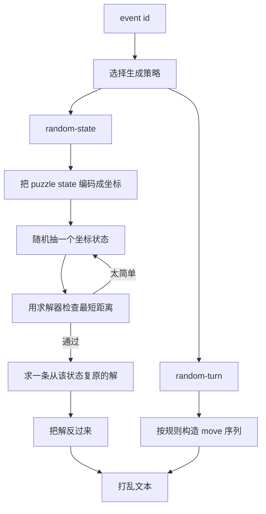

# 生成模型



如果只记一句话：**打乱生成不是先写字符串，而是先决定一个目标状态；字符串只是到达这个状态的一条路径。**

下面把这个过程拆到算法层。为了不被术语淹没，我们从一个最小例子开始：2x2。

::: tip 进阶阅读顺序
如果你想看更接近源码的数据结构，先读 [状态空间与坐标编码](./state-space)，再读 [搜索与剪枝](./search-pruning)。这一页负责串起主线，那两页负责解释「为什么这些伪代码能跑得动」。
:::

## 例子：一条 2x2 打乱怎么生成

2x2 只有角块，所以状态可以拆成两类数字：

| 状态部分 | 含义 | 数量级 |
| --- | --- | ---: |
| permutation | 7 个角块相对位置，最后一个由约束决定 | 5040 |
| orientation | 7 个角块朝向，最后一个由朝向和决定 | 729 |

生成器不会直接随机拼 `R U F`。它做的是：

```ts
for attempt in 0..99:
  state = random2x2State()

  // WCA: 2x2 状态至少需要 4 步才能复原
  if solveIn(state, maxDepth = 3) exists:
    continue

  // 找一条正好 11 步的路径，把 solved 带到这个 state
  return generateExactly(state, length = 11)

throw "could not generate"
```

这里最关键的是 `solveIn(state, 3)`。它不是为了输出打乱，而是为了判断这个状态是不是太简单：如果 3 步以内能复原，就拒绝。

## Move table：先把「转一下」预计算好

求解器要频繁问一个问题：如果当前状态是 `X`，做一个 move 以后会到哪个状态？

如果每次都真的移动 7 个角块，会慢。更常见的做法是提前建表：

```ts
movePerm[permutation][move] = nextPermutation
moveOrient[orientation][move] = nextOrientation
```

2x2 只用 `U`、`R`、`F` 三个面和它们的三种转法，所以共有 9 种 move。建表以后，搜索时只要查数组就能走到下一个状态。

这一步可以理解为给状态空间画地图：每个点是一个状态，每条边是一种 move。

更完整的坐标解释见 [状态空间与坐标编码](./state-space)。

## Pruning table：快速知道「至少还差几步」

光有地图还不够。搜索会爆炸，所以还需要一个「最短距离下界」表。

Pruning table 从 solved state 开始，用 BFS 一层层往外扩：

```ts
pruning[solved] = 0

for depth = 0, 1, 2, ...
  for each state whose pruning value is depth:
    for each move:
      next = applyMove(state, move)
      if pruning[next] is unknown:
        pruning[next] = depth + 1
```

这样搜索时就能剪枝：

```ts
if pruning[currentState] > remainingDepth:
  stop searching this branch
```

意思是：表已经告诉我「从这里回 solved 至少要 N 步」，如果我只剩比 N 更少的步数，就不可能成功，直接放弃这条分支。

这就是为什么 `solveIn(state, 3)` 可以高效判断「3 步内能不能复原」。

更完整的搜索过程见 [搜索与剪枝](./search-pruning)。

## 为什么「反向解」就是打乱

假设我们随机抽到目标状态 `T`，求解器找到一条解：

```text
T --A B C--> solved
```

那把这条解倒过来、每步取反，就得到：

```text
solved --C' B' A'--> T
```

这条 `C' B' A'` 就是打乱。它不是随机拼出来的，而是「通往随机目标状态的路径」。

所以 random-state 的完整逻辑是：

```ts
target = sampleRandomState()
if target is too close to solved:
  retry

solution = solve(target -> solved)
scramble = inverse(solution)
```

## 3x3：为什么要 two-phase

3x3 状态比 2x2 大很多，状态通常拆成：

| 坐标 | 含义 |
| --- | --- |
| corner permutation | 角块位置 |
| corner orientation | 角块朝向 |
| edge permutation | 棱块位置 |
| edge orientation | 棱块朝向 |

随机抽 3x3 状态时不能随便抽这些数字。它必须满足魔方物理约束：

- 角块和棱块 permutation parity 要匹配；
- 角块朝向总和要合法；
- 棱块翻转总和要合法。

抽到合法状态以后，3x3 使用 two-phase solver。你可以这样理解它：

1. Phase 1：先把状态带进一个更规整的中间集合。
2. Phase 2：在这个中间集合里完成复原。

这样比直接在全部 3x3 状态空间里乱搜要快得多。生成器拿到的是「目标状态到 solved 的解」，再输出它的反向路径。

## 轴限制：为什么有些事件要限制首尾 move

有些事件会在主体打乱前后追加固定 move 或 orientation move。如果主体打乱的第一步/最后一步和外层 move 在同一轴上，可能会产生抵消或合并。

例如 FMC 会加固定 padding，盲拧会追加随机定向。生成器因此会要求：

```ts
first move must not collide with prefix axis
last move must not collide with suffix/orientation axis
```

如果求解器找到的解违反轴限制，就重试。这不是为了改变目标状态公平性，而是为了保证最终字符串格式干净、符合事件需求。

## Random-turn：大项目为什么不抽完整状态

5x5、6x6、7x7 的完整 random-state 非常重，所以 WCA 允许足够多随机转动。这里的算法是另一类：

```ts
while moves.length < requiredLength:
  face = chooseFace(axis != previousAxis)
  width = chooseLayerWidth(size)
  suffix = choose("", "2", "'")
  moves.push(face + width + suffix)
  previousAxis = axis(face)
```

这不是等概率抽状态，而是按规则构造一条足够长、避免明显重复轴的 move 序列：

| 项目 | 长度 |
| --- | ---: |
| 5x5 | 60 |
| 6x6 | 80 |
| 7x7 | 100 |

Megaminx 也是 random-turn，但格式是 7 行，每行交替 `R` 和 `D`，最后用 `U` 或 `U'` 收尾。

## Square-1：为什么它特殊

Square-1 会变形，状态不只是 piece 位置，还包含当前形状是否能 slash。生成大致是：

```ts
for attempt in 0..99:
  randomState = randomSquare1State()
  solution = solveSquare1(randomState)
  if no solution:
    continue

  scramble = inverse(solution)
  state = apply(scramble, solvedSquare1)

  if solveIn(state, maxDepth = 10) exists:
    continue

  return scramble
```

这里多了一步 `apply(scramble, solvedSquare1)`，因为 Square-1 需要确认输出的 tuple/slash 序列确实能从 solved 合法走到目标状态，并且不违反 11 步最短距离要求。

## Clock：为什么它不像魔方

Clock 没有 sticker permutation。它的状态是 18 个表盘位置。生成器直接给一组表盘组合随机选择偏移：

```text
UR DR DL UL U R D L ALL
y2
U R D L ALL
```

每个 token 像 `UR3+`，意思是把对应表盘组转 3 格。`y2` 表示翻到另一面继续生成。

## 总结

打乱生成可以分成两大类：

| 类型 | 用在哪里 | 核心逻辑 |
| --- | --- | --- |
| random-state | 2x2、3x3、4x4、Pyraminx、Skewb、Square-1 等 | 抽状态、过滤太近状态、求解、反向输出 |
| random-turn | 5x5、6x6、7x7、Megaminx、Clock | 按项目规则构造足够长或固定格式的随机 move |

真正的核心不是「随机字符串」，而是这三个问题：

1. 这个项目的状态怎么表示？
2. 怎么保证抽到的状态不太简单、且符合规则？
3. 怎么把目标状态转换成选手能执行的打乱文本？
