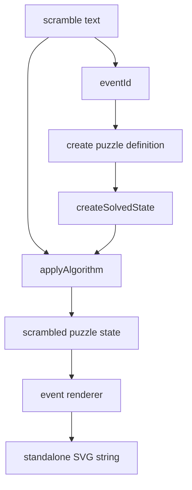

# 打乱图生成原理

打乱图不是直接把字符串画出来，而是先把打乱应用到一个 solved state，得到 puzzle 的最终贴纸状态，再把这个状态渲染成 SVG。

## Dispatch

`renderScrambleImage(eventId, scramble)` 先根据 `WCA_EVENT_INFO[eventId].puzzleId` 找到 puzzle 家族。Cube 事件会进一步映射到尺寸：`222` 是 2 阶，`333bld` 和 `333mbld` 都按 3 阶单条打乱渲染，`555bld` 按 5 阶渲染。

## Renderers

不同 puzzle 的视觉结构不同：

- Cube family 渲染为展开的 cube net。
- Clock 渲染双面表盘和 pin 状态。
- Megaminx/Pyraminx/Skewb/Square-1 使用各自的几何布局。

所有 renderer 都返回字符串，不依赖 DOM、canvas 或 React。这样同一套能力可以在 Node 测试、Web Worker 或静态诊断里使用。

## 为什么 SVG 输出是字符串

字符串输出让边界非常清晰：`scramble-image` 只负责生成安全、可序列化的 SVG；调用方决定如何插入页面、下载文件或截图。playground 的下载功能就是把这段 SVG 字符串封装成 Blob。

关键文件：

- [`packages/scramble-image/src/render.ts`](https://github.com/deweyou/cubekit/blob/main/packages/scramble-image/src/render.ts)
- [`packages/scramble-image/src/renderers/cube-net.ts`](https://github.com/deweyou/cubekit/blob/main/packages/scramble-image/src/renderers/cube-net.ts)
- [`packages/scramble-image/src/svg/svg-serialize.ts`](https://github.com/deweyou/cubekit/blob/main/packages/scramble-image/src/svg/svg-serialize.ts)
