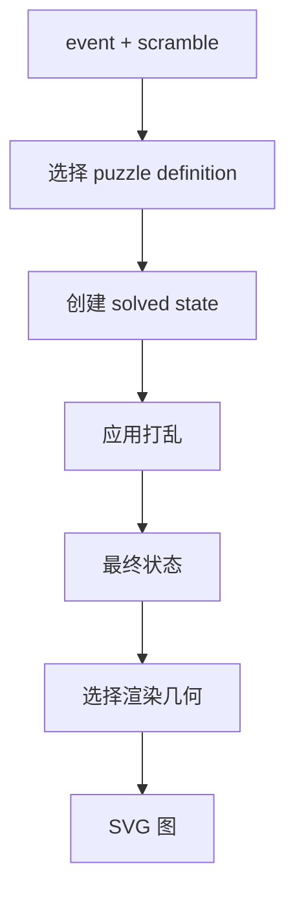

# 打乱图生成原理



打乱图是从最终状态生成的，不是从打乱文本直接生成的。Renderer 问的不是「字符串里有哪些 move」，而是「这些 move 之后 puzzle 长什么样」。

## 通用流程

每个项目都走同一条高层流程：

1. 根据 event id 选择 puzzle family。
2. 创建这个 puzzle 的 solved state。
3. 解析并应用打乱，得到最终状态。
4. 选择对应 puzzle 的 renderer。
5. 序列化成 SVG。

SVG 适合这里，因为它是文本、可缩放、输出稳定，也方便测试。

## 各类图怎么画

| Puzzle family | 画图思路 |
| --- | --- |
| NxN cubes | 展开的 cube net，每个 sticker 一个方块 |
| Clock | 两个圆形表盘面、18 个指针和 pin |
| Megaminx | 把五边形面展开成易读布局 |
| Pyraminx | 三角面和更小的 tip pieces |
| Skewb | 按 Skewb sticker 几何展开的面布局 |
| Square-1 | 用上下层 piece arc 表达变形后的形状 |

布局是 puzzle-specific 的，但输入始终是同一种东西：验证过的最终状态。

## Cube net：状态到方块坐标

NxN 魔方图通常画成展开图。Renderer 会先决定 6 个 face 在平面上的位置：

```text
        U
    L   F   R   B
        D
```

然后对每个 face 的每个 sticker 生成一个 SVG rect：

```ts
for face in faces:
  origin = faceOrigin(face)

  for row in 0..size-1:
    for col in 0..size-1:
      color = state.stickers[face][row][col]
      drawRect(
        x = origin.x + col * stickerSize,
        y = origin.y + row * stickerSize,
        fill = color
      )
```

注意这里不再关心打乱字符串。`state.stickers` 已经是应用完打乱之后的最终颜色分布。

## Clock：表盘位置到指针角度

Clock state 是 18 个 `0..11` 的数字。Renderer 会把每个数字转换成角度：

```ts
angle = position * 30deg
```

因为一圈 12 格，每格 30 度。然后画：

- 两个大圆表示正反面；
- 每面 9 个小表盘；
- 每个表盘一根旋转后的指针；
- pin 和顶部刻度用不同颜色强调方向。

`rightSideUp` 会影响正反面颜色和指针解释。`y2` 在状态转换里已经把正反面交换好，renderer 只消费最终状态。

## Square-1：piece arc 而不是 sticker grid

Square-1 不能画成规则网格，因为它会变形。Renderer 需要根据上下层 piece 顺序画扇形/弧形 piece：

```ts
angle = startAngle

for piece in topLayer:
  span = piece is corner ? 60deg : 30deg
  drawArc(center, innerRadius, outerRadius, angle, angle + span)
  angle += span
```

Corner piece 占 60 度，edge piece 占 30 度。`/` 改变的是 piece 在上下层的分布和顺序，所以最终图的形状来自状态，而不是来自某个单独 move。

## 为什么输出 SVG string

SVG string 的好处是边界清晰：

```text
state -> SvgNode tree -> serialized SVG string
```

Renderer 不依赖 DOM，也不依赖 canvas。测试里可以直接检查 SVG 的 `viewBox`、`rect/path/circle` 数量和颜色；浏览器里可以把字符串注入页面；下载时可以把字符串包成 Blob。

## 打乱图为什么也能做校验

渲染有一个很有用的副作用：如果打乱不能解析，或者不能合法应用到状态，就无法得到最终状态，自然也画不出图。因此打乱图生成可以作为生成器的 smoke test：合法生成器应该产出能解析、能应用、能画图的文本。

## Renderer 不负责什么

Renderer 不判断打乱是否公平。公平性属于生成器和 WCA 规则。Renderer 只负责把给定 event 和 scramble 产生的状态画出来：

- 生成器回答「应该到达哪个状态」；
- 状态转换回答「这段文本会到达什么状态」；
- Renderer 回答「这个状态应该怎么画」。
