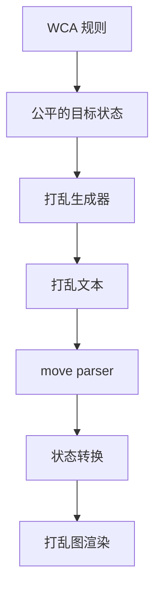

# WCA 打乱生成与打乱图

::: warning 官方比赛提示
CubeKit 是学习与开发实现，不是 WCA 官方打乱程序。正式比赛必须使用 WCA 发布的当前官方打乱程序。
:::

这份文档只讲打乱和打乱图的原理，不讲包怎么使用。你可以把「打乱字符串」看成最后露出来的一层：它背后先要决定目标状态，再按规则避开太简单的状态，然后用求解器或随机转动策略生成文本；打乱图又会把这段文本重新解析、应用到 solved state，最后画出结果。

## 学习路径

1. 先看 [规则与公平性](./wca-rules)，理解为什么「随机 move」不等于公平打乱。
2. 再看 [生成模型](./generation)，理解 random-state 和 random-turn 两条主线。
3. 进入 [状态空间与坐标编码](./state-space)，理解 puzzle state 为什么能变成数字。
4. 继续看 [搜索与剪枝](./search-pruning)，理解求解器为什么能高效过滤和求解。
5. 然后看 [各项目打乱策略](./event-families)，逐个理解每类魔方/项目为什么这样生成。
6. 接着看 [状态转换](./state-transition)，理解 move parser 到 puzzle state 的桥。
7. 最后看 [打乱图生成原理](./image-rendering)，理解为什么图是从状态画出来的。

## 先记住三件事

- 打乱是否公平，看的是最终 puzzle state，不是字符串看起来乱不乱。
- 小型项目通常可以「随机抽状态 -> 求解 -> 反过来作为打乱」。
- 大型项目常用有约束的 random-turn，因为完整等概率状态采样成本太高。
- 打乱图不是把字符串画出来，而是把字符串应用到状态以后，再画最终状态。

## 资料来源

- [WCA Regulations, Article 4](https://www.worldcubeassociation.org/regulations/#article-4-scrambling)
- [WCA official scrambles page](https://www.worldcubeassociation.org/regulations/scrambles/)
- [thewca/tnoodle-lib](https://github.com/thewca/tnoodle-lib)
- [CubeKit TNoodle notes](https://github.com/deweyou/cubekit/blob/main/docs/tnoodle-implementation-notes.md)
