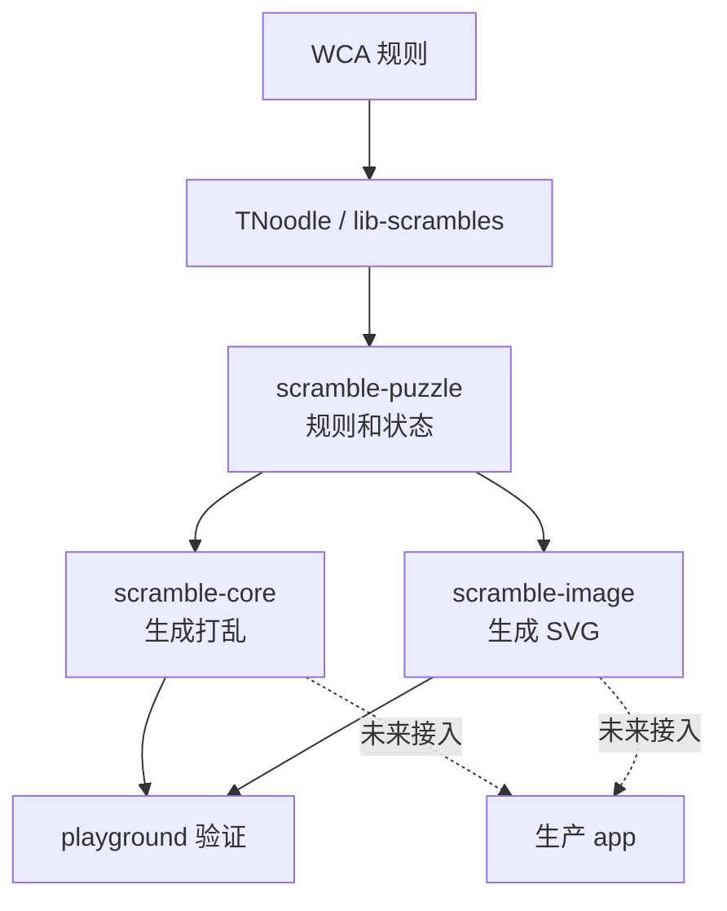

# WCA 打乱生成与打乱图总览

::: warning 官方比赛提示
CubeKit 不是官方 WCA 打乱程序。正式比赛必须使用 WCA 网站发布的当前官方打乱程序。
:::

这个站点解释 CubeKit 中 WCA 魔方打乱生成和打乱图生成的工程原理。它不是 API 文档，也不是比赛用工具；它的目标是让你理解三件事：

- WCA 规则为什么强调「随机状态」而不是随便打一串随机转动。
- TNoodle 风格的生成器如何把事件、随机源、求解器和特殊规则串起来。
- 打乱图为什么依赖 move parser 和 state transition，而不是直接画打乱字符串。

CubeKit 当前记录的兼容基线是 TNoodle-WCA `1.2.3`、`thewca/tnoodle-lib v0.19.2`。版本和升级流程见仓库内的 [TNoodle baseline](https://github.com/deweyou/cubekit/blob/main/docs/tnoodle-baseline.md)。

## 学习路径

1. 从 [WCA 打乱规则](./wca-rules) 开始，理解随机状态和各事件例外。
2. 阅读 [打乱生成原理](./generation)，看生成管线如何落到代码。
3. 阅读 [Move Parser 与状态转换](./state-transition)，理解通用 puzzle 能力。
4. 阅读 [打乱图生成原理](./image-rendering)，把状态转换和 SVG 渲染串起来。
5. 最后看 [CubeKit 包边界](./cubekit-packages)，了解三包拆分和测试策略。

## 关键来源

- [WCA Regulations, Article 4](https://www.worldcubeassociation.org/regulations/#article-4-scrambling)
- [WCA official scrambles page](https://www.worldcubeassociation.org/regulations/scrambles/)
- [thewca/tnoodle-lib](https://github.com/thewca/tnoodle-lib)
- [CubeKit scramble package notes](https://github.com/deweyou/cubekit/blob/main/docs/tnoodle-implementation-notes.md)
