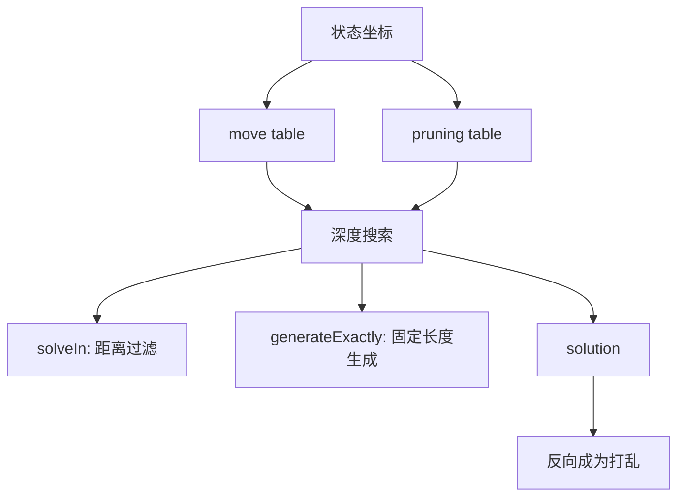
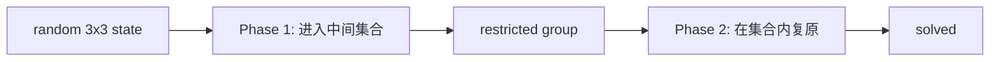

# 搜索与剪枝



这一页回答一个更进阶的问题：**求解器为什么能在巨大的状态空间里快速判断、搜索和生成？**

核心工具是两类表：move table 和 pruning table。

## Move table：把「应用 move」变成数组查询

假设一个 2x2 状态坐标是：

```ts
state = {
  permutation: 1234,
  orientation: 321
}
```

如果做一个 `R`，新的 `permutation` 和 `orientation` 是多少？朴素做法是展开角块、旋转、再重新编码。搜索里这件事会发生几百万次，所以要预计算：

```ts
movePerm[1234][R] = 3051
moveOrient[321][R] = 117
```

搜索时一步转动就变成：

```ts
next = {
  permutation: movePerm[state.permutation][move],
  orientation: moveOrient[state.orientation][move]
}
```

这就是状态图的邻接表：给定一个点和一条边，马上知道下一个点。

## Pruning table：记录「保守估计还差几步」

Move table 告诉我们能往哪里走，但还不能告诉我们哪条路值得走。Pruning table 用来剪掉不可能成功的分支。

它从 solved state 开始建：

```ts
prun[solved] = 0
frontier = [solved]

while frontier not empty:
  state = frontier.pop()
  for move in moves:
    next = applyMoveByTable(state, move)
    if prun[next] is unknown:
      prun[next] = prun[state] + 1
      frontier.push(next)
```

这样 `prun[x] = 5` 的意思是：从坐标 `x` 到 solved 至少要 5 步，或者在这个坐标维度上至少要 5 步。

注意「在这个坐标维度上」很重要。2x2 会分别有 permutation pruning 和 orientation pruning。搜索时取更严格的那个下界：

```ts
lowerBound = max(
  prunPerm[current.permutation],
  prunOrient[current.orientation]
)

if lowerBound > remainingDepth:
  prune
```

这不是猜测，而是数学下界：如果下界都超过剩余步数，这条路必死。

## solveIn：为什么能过滤太简单状态

WCA 最短距离过滤常见写法是：

```ts
isTooClose = solver.solveIn(state, minimumDistance - 1) !== null
```

以 2x2 为例，minimumDistance 是 4，所以检查 3 步内是否存在解：

```ts
if solveIn(state, 3) exists:
  reject state
```

`solveIn` 会从长度 0 开始试到最大长度：

```ts
for length in 0..maxLength:
  if depthLimitedSearch(state, length):
    return solution
return null
```

如果返回 `null`，说明这个状态在允许搜索深度内解不掉，也就是通过了最短距离过滤。

## generateExactly：为什么能生成固定长度

有些小 puzzle 的 WCA/TNoodle 风格输出会使用固定长度。生成器不是「求最短解」，而是搜索一个正好指定长度的路径：

```ts
solution = search(state, desiredLength, exactLength = true)
```

这看起来反直觉：为什么要正好 11 步，而不是最短？原因是打乱字符串要有稳定、可预期的形态；公平性仍然来自前面的 target state 抽样和距离过滤。

如果短解存在，固定长度搜索仍然可以通过绕一些不抵消的路径达到目标长度；但搜索会避免直接连续反向 move 或同 face 重复等明显坏形态。

## 深度优先 + 剪枝：一层层试长度

多数这类求解器不是一次性开一个巨大的 BFS，而是用深度限制搜索。可以理解为：

```ts
function search(state, depth, lastMove):
  if depth == 0:
    return isSolved(state)

  if lowerBound(state) > depth:
    return false

  for move in allowedMoves:
    if move conflicts with lastMove:
      continue
    next = applyMoveByTable(state, move)
    if search(next, depth - 1, move):
      record move
      return true

  return false
```

然后外层逐渐增加深度：

```ts
for depth = minPossibleDepth..maxDepth:
  if search(state, depth):
    return solution
```

这就是 IDA* 风格的核心直觉：像 DFS 一样省内存，但用 pruning table 的下界避免乱搜。

## 3x3 two-phase 的剪枝直觉

3x3 的状态空间太大，不能直接像 2x2 那样简单处理。Two-phase 的关键是把任务拆成两个更小的搜索问题：



Phase 1 不要求直接 solved，只要求把状态带进一个约束更强的集合。Phase 2 再在这个集合内完成复原。每个阶段都有自己的坐标和剪枝表，因此搜索空间比直接暴力搜小很多。

打乱生成拿到的是：

```text
target --phase1 moves + phase2 moves--> solved
```

再把它反向输出。

## Square-1 的两阶段搜索

Square-1 也有两阶段，但原因不同。它先要处理 shape：

1. Phase 1：通过 `(a,b)` 和 `/` 让形状进入可规整求解空间。
2. Phase 2：在规整形状下处理 edge/corner permutation 和 middle layer。

它的 pruning table 也分 shape pruning 和 permutation pruning。因为 slash 合不合法取决于当前形状，所以 Square-1 搜索还要随时判断 successor 是否可走。

## 随机性在哪里

这里有个常见误解：求解器搜索本身不一定是随机的。随机性主要来自：

- 随机抽 target state；
- 当多个 move 都可选时，搜索顺序可以被随机源打散；
- random-turn 事件直接随机选择 face、width、suffix。

Random-state 事件的公平性关键在第一点：目标状态的抽样。

## 你现在可以把生成器读成三层

```text
WCA rule layer
  - 最短距离、项目例外、盲拧定向

state sampling layer
  - 坐标编码、合法状态抽样、物理约束

solver layer
  - move table、pruning table、搜索、反向解
```

理解这三层，再看任何项目的生成器就不会迷路。
