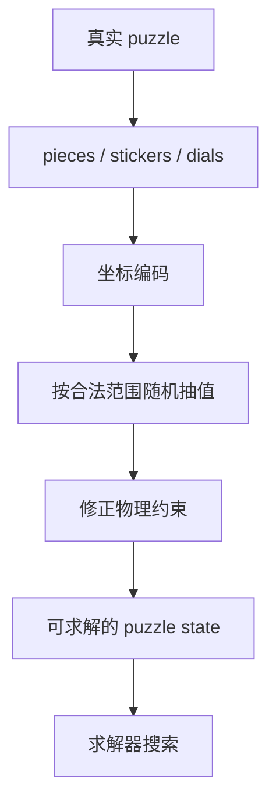

# 状态空间与坐标编码



真正的 random-state 生成必须先回答一个问题：**怎么把一个真实 puzzle state 变成可以随机抽取、可以搜索的数字？**

程序不会在内存里拿着一整个实体魔方转来转去。它通常会把状态压缩成若干坐标。坐标越小，搜索越快；但坐标必须保留足够信息，不能把两个不同状态混成一个。

## 坐标不是展示状态

同一个 puzzle 往往有两套状态：

| 状态类型 | 主要用途 | 例子 |
| --- | --- | --- |
| 求解器坐标 | 搜索、建表、剪枝 | `permutation = 1234`, `orientation = 321` |
| 渲染状态 | 画出最终贴纸或表盘 | 每个 sticker 的颜色、Clock 指针位置 |

打乱生成关心第一种。打乱图关心第二种。二者可以互相转换，但设计目标不同。

## 2x2：固定参考角块后的角块坐标

2x2 只有 8 个角块。为了避免把整体转体也算成不同状态，TNoodle 风格的 2x2 求解器固定一个参考角块，只编码剩下 7 个角块：

| 坐标 | 数量 | 为什么 |
| --- | ---: | --- |
| `permutation` | `7! = 5040` | 7 个角块的位置排列 |
| `orientation` | `3^6 = 729` | 6 个角块朝向自由，最后一个由总朝向决定 |

朝向为什么是 `3^6`，不是 `3^7`？因为真实 2x2 不允许角块朝向总和任意变化。前 6 个角块朝向确定后，最后一个角块朝向被物理约束决定。

随机状态可以这样想：

```ts
permutation = randomInt(5040)
orientation = randomInt(729)
state = { permutation, orientation }
```

之后求解器会用这两个数字查 move table 和 pruning table。

## 3x3：抽状态时必须满足物理约束

3x3 状态更大，通常拆成四类坐标：

| 坐标 | 范围直觉 | 约束 |
| --- | --- | --- |
| corner permutation | 8 个角块排列 | parity 要和 edge permutation 匹配 |
| edge permutation | 12 个棱块排列 | parity 要和 corner permutation 匹配 |
| corner orientation | 角块扭转 | 总和必须合法 |
| edge orientation | 棱块翻转 | 总和必须合法 |

如果直接随机抽这四类数字，很多组合在真实魔方上根本不存在。比如只交换两个角块、不交换棱块，这个状态无法通过合法转动到达。

所以 3x3 随机状态生成会做两件事：

```ts
cornerPerm = randomPermutation(8)
cornerParity = parity(cornerPerm)

edgePerm = randomPermutationWithParity(12, cornerParity)
cornerOrientation = randomOrientation(base = 3, lastValueConstrained = true)
edgeOrientation = randomOrientation(base = 2, lastValueConstrained = true)
```

这里的 parity 可以理解为「排列奇偶性」。真实 3x3 要求角块排列和棱块排列奇偶性一致。

## Pyraminx：主体和 tips 分开

Pyraminx 的状态不只是一组 face turn。它可以拆成：

| 坐标 | 含义 |
| --- | --- |
| `edgePerm` | 棱块排列 |
| `edgeOrient` | 棱块朝向 |
| `cornerOrient` | 主体角块朝向 |
| `tips` | 四个 tip 的朝向 |

WCA 最短距离规则关注主体状态，tips 是额外可见 move。生成器会抽完整状态，但在检查主体距离时可以不把 tips 算进主体搜索深度；最后再把未复原的 tips 追加成小写 move。

## Skewb：中心和角的紧凑坐标

Skewb 的求解器把状态压成两个坐标：

| 坐标 | 数量级 | 含义 |
| --- | ---: | --- |
| `perm` | 4320 | 中心/角块排列的组合编码 |
| `twst` | 2187 | 角块朝向 |

Skewb 只用 `L`、`R`、`B`、`U` 四类基本 move 搜索。坐标小，所以可以预计算 move table 和 pruning table。

## Square-1：形状本身也是状态

Square-1 最特殊，因为它会变形。一个状态不仅要知道 piece 顺序，还要知道当前形状能不能切：

```text
top layer shape
bottom layer shape
top/bottom piece order
middle layer position
slashability
```

因此 Square-1 搜索通常分两段：

1. Phase 1：先处理形状，让 puzzle 进入可规整求解的形状空间。
2. Phase 2：在规整形状下处理 piece permutation。

这也是为什么 Square-1 的打乱要用 `(a,b)` 和 `/`，而不是普通魔方面转记号。

## Clock：状态不是 piece，而是 18 个数

Clock 的状态最不像魔方。它没有贴纸置换，只有表盘位置：

```ts
positions = [
  front0, front1, ..., front8,
  back0, back1, ..., back8
]
```

每个位置是 `0..11`，表示指针相对 12 点方向偏了几格。`y2` 会交换正反面，普通 Clock move 会把一组表盘一起加上某个偏移。

## 为什么这页重要

后面的求解和剪枝都建立在这些坐标上：

- move table 需要知道「坐标 + move -> 新坐标」；
- pruning table 需要知道「某个坐标至少几步到 solved」；
- random-state 需要能在合法状态空间里抽样；
- 打乱图最终要把文本应用回更直观的渲染状态。

如果状态编码错了，后面的搜索再快也没意义。
