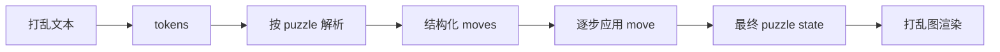

# 状态转换

状态转换是打乱文本和真实 puzzle state 之间的桥。没有状态转换，系统只知道一段字符串；有了状态转换，系统才能回答：「如果从 solved state 开始应用这些 move，每个贴纸、表盘或 piece 最后在哪里？」

## Parser 不只是 split

不同 puzzle 的记号语法不一样。Cube 的 `Rw2` 是宽层转；Megaminx 的 `R++` 是固定方向的两格转；Square-1 的 `(3,-2)` 是上下层转动组合，`/` 是切层；Clock move 里还包含表盘组、数字和方向。

Parser 会把这些字符串变成结构化 move，后续代码不用猜这个 token 到底什么意思。

## 应用 move

应用 move，就是从旧状态得到新状态：

- cube-family 会移动 face 上的 sticker 或 cubie；
- Clock 会按 12 取模更新表盘位置，并在 `y2` 时交换正反面；
- Pyraminx 和 Skewb 会按各自几何结构旋转 piece；
- Square-1 会同时更新 piece 顺序和形状。

状态模型也会验证非法 move。比如 Square-1 的 `/` 只有在当前形状允许切开时才合法。

## 为什么打乱图依赖状态

Renderer 不应该把 `R U R'` 当文字画出来，而应该画出这些 move 之后 puzzle 的样子。所以打乱图流程会先解析和应用打乱，再把最终状态交给 renderer。这个过程还能在画图前发现非法打乱。

## 一个小例子

以 3x3 的 `R U` 为例：

1. 从 solved cube state 开始。
2. 把 `R U` 解析成两个 cube moves。
3. 应用 `R`，右面和相邻条带上的贴纸位置变化。
4. 应用 `U`，顶面和相邻条带继续变化。
5. 把最终 sticker 位置画成 cube net。

所有 puzzle 都是这个思路，只是几何和状态结构不同。
