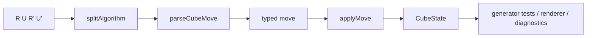

# Move Parser 与状态转换

Move parser 和 state transition 是通用能力。它们不属于「生成器」或「渲染器」某一边，而是两边都需要的 puzzle 语义层。

## Parser 做什么

Parser 把字符串变成带类型的 move。例如 `Rw2` 不是普通文本，而是一个宽层转动；`(3,-2)` 是 Square-1 tuple move；Clock 的 `UR3+` 也有自己的 pin 和 dial 语义。Parser 的职责是拒绝非法记号，并把合法记号变成后续代码可以安全消费的数据结构。

## State transition 做什么

State transition 定义「在某个 puzzle 状态上应用一个 move 后得到什么新状态」。这不是为了画图才存在，也不是为了测试才存在；它是 puzzle 行为本身。渲染器需要它来知道每个 sticker 最后在哪里，生成器测试也需要它来验证输出可以被解析和应用。

## 为什么要拆成 `scramble-puzzle`

如果 parser 被写在 generator 里，renderer 就只能重复实现一套。如果 parser 写在 renderer 里，生成器就无法独立验证输出。`@cubekit/scramble-puzzle` 把事件元数据、parser、状态和 puzzle definition 收拢在一起，让 `scramble-core` 和 `scramble-image` 共用同一套语义。

错误边界也在这里统一：单个 move 解析失败会变成 `InvalidMoveError`；整条 scramble 应用失败会包装为 `InvalidScrambleError`。这让上层可以区分「这个 token 不合法」和「这条算法整体不能应用」。

关键文件：

- [`packages/scramble-puzzle/src/algorithm.ts`](https://github.com/deweyou/cubekit/blob/main/packages/scramble-puzzle/src/algorithm.ts)
- [`packages/scramble-puzzle/src/cube/cube-parser.ts`](https://github.com/deweyou/cubekit/blob/main/packages/scramble-puzzle/src/cube/cube-parser.ts)
- [`packages/scramble-puzzle/src/square1/square1-state.ts`](https://github.com/deweyou/cubekit/blob/main/packages/scramble-puzzle/src/square1/square1-state.ts)
