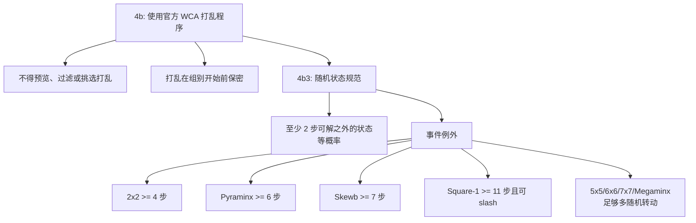

# WCA 打乱规则

::: warning 官方比赛提示
CubeKit 的实现用于学习、开发和测试。正式比赛必须使用 WCA 网站发布的当前官方打乱程序。
:::

WCA 规则的核心不是「打乱字符串看起来很乱」，而是「打乱程序产生的状态集合公平」。当前规则 4b 要求比赛打乱必须由官方程序生成；4b1 进一步禁止赛前查看、过滤或挑选打乱；4b3 定义了官方打乱程序应该产生什么样的状态。

4b3 的默认要求可以理解为：从所有至少需要 2 步才能复原的状态里等概率抽取一个状态，再输出一条能到达这个状态的打乱序列。若只随机拼接若干转动，不同状态被命中的概率通常不相等，因此不能自然满足 random-state 的公平性。

## 事件例外

| 事件 | 规则含义 | CubeKit 对应 |
| --- | --- | --- |
| 2x2 | 采样状态必须至少 4 步可解 | `generateTwoByTwoScramble` 会过滤太近状态 |
| Pyraminx | 主体状态至少 6 步可解，tips 不算主体距离 | `generatePyraminxScramble` 先过滤主体，再追加 tips |
| Skewb | 状态至少 7 步可解 | `generateSkewbScramble` 使用求解器过滤 |
| Square-1 | 至少 11 步可解，并且初始状态允许 `/` | `generateSquareOneScramble` 使用 Square-1 metric |
| 5x5/6x6/7x7/Megaminx | 使用足够多随机转动，而不是完整 random-state | 固定长度 random-turn 生成器 |

盲拧事件还有一个额外要求：打乱序列必须随机定向 puzzle。CubeKit 通过 no-inspection orientation moves 处理 `333bld`、`444bld`、`555bld` 和 `333mbld`。

## 工程影响

这些规则决定了实现不能只有一个「随机选择 move」函数。小型 random-state 事件需要「采样状态 -> 检查最短距离 -> 求逆解」；大型 random-turn 事件需要固定长度和轴限制；图片渲染还需要能验证打乱字符串可以解析并应用到状态。

参考：

- [WCA Regulation 4b3](https://www.worldcubeassociation.org/regulations/#4b3)
- [CubeKit WCA generation notes](https://github.com/deweyou/cubekit/blob/main/docs/packages/scramble-core/wca-generation-rules.md)
