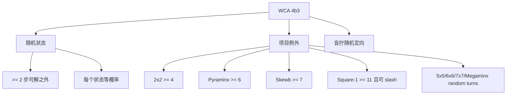

# 规则与公平性



WCA 打乱规则的核心是「状态公平」，不是「字符串看起来随机」。按照当前 2026 年 4 月 1 日版本的 WCA Regulations，4b3 的默认含义是：从所有至少需要 2 步才能复原的状态中随机选择一个状态，并且每个状态概率相同。之后规则再列出各项目例外。

为什么不能只随机拼 move？因为同一个最终状态可能被很多条 move 序列到达，另一个状态可能只有很少序列能到达。字符串等概率，不代表状态等概率。

## 最短距离过滤

最短距离过滤可以先理解为：不要生成太接近 solved 的状态。实现上会更严格一点：随机抽到一个状态以后，用求解器检查它是否能在禁止范围内复原。如果可以，就说明它太简单，丢掉重抽。

| 项目族 | 规则含义 | 生成器思路 |
| --- | --- | --- |
| 大多数 random-state 项目 | 至少 2 步可解之外 | 抽状态、过滤简单状态、反向求解 |
| 2x2 | 至少 4 步 | 抽角块状态，用 2x2 求解器过滤 |
| Pyraminx | 至少 6 步 | 主体状态过滤，tips 作为可见小写 move 追加 |
| Skewb | 至少 7 步 | 抽 Skewb 状态，用专门求解器过滤 |
| Square-1 | 至少 11 步，且初始允许 `/` | 抽 Square-1 状态，用 Square-1 metric 过滤 |
| 5x5/6x6/7x7/Megaminx | 足够多随机转动 | 有约束的 random-turn 序列 |

## 规则怎么落到生成算法

把 4b3 翻译成算法，大概就是下面这个循环：

```ts
while true:
  targetState = sampleUniformStateForThisPuzzle()

  // 例如 2x2 是 4，所以检查 3 步内是否能解
  if solver.canSolveWithin(targetState, minimumDistance - 1):
    continue

  solution = solver.solve(targetState)
  return inverse(solution)
```

这里有三个容易混淆的点：

1. `sampleUniformStateForThisPuzzle` 抽的是状态，不是 move 字符串。
2. `canSolveWithin` 是规则过滤器：它只判断「是不是太简单」。
3. `inverse(solution)` 才是最终给选手执行的打乱。

对于 random-turn 例外，算法会换成「生成足够多、格式受控的 move」。这就是为什么 5x5/6x6/7x7 和 Megaminx 的生成逻辑看起来不像 2x2/3x3。

## 盲拧定向

盲拧项目还有一个额外公平性：puzzle orientation。若总是用同一朝向给选手，盲拧状态就不完整随机。TNoodle 风格的生成器会在基础打乱后追加随机定向 move，比如整体转体或宽层 move。

多盲也是这个逻辑的重复：每个 cube 都拿到一条自己的 3x3 盲拧打乱。所以 `333mbld` 应该理解成多行打乱，而不是一条超长普通 3x3 打乱。

参考：

- [WCA Regulation 4b3](https://www.worldcubeassociation.org/regulations/#4b3)
- [WCA official scrambles page](https://www.worldcubeassociation.org/regulations/scrambles/)
