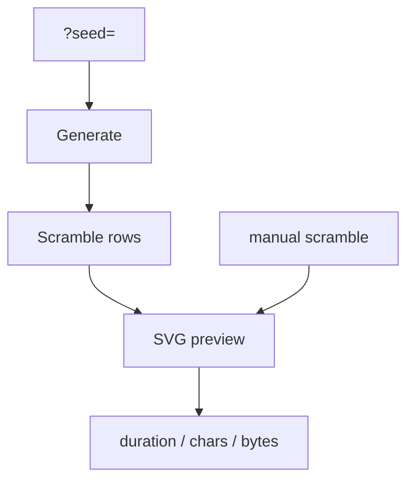

# Diagnostics And E2E

Playground diagnostics are intentionally lightweight. They exist to make package
integration failures visible during local testing and future E2E smoke checks.

## Key Rules

- Use `http://127.0.0.1:5173/?seed=42` for deterministic browser checks.
- E2E should verify the integration chain: UI controls -> `scramble-core` ->
  `scramble-image` -> SVG preview.
- E2E for image rendering should exercise the `2D` / `3D` switch and assert that
  supported events change SVG shape while fallback families still render.
- E2E should not replace package unit tests or golden WCA rule coverage.
- Copy/download actions are convenience checks for generated rows and selected
  SVG output.

## Key Files

- [apps/playground/src/playground/browser-seed.ts#L1](../../../apps/playground/src/playground/browser-seed.ts#L1) - deterministic seed parsing.
- [apps/playground/src/playground/playground-service.ts#L1](../../../apps/playground/src/playground/playground-service.ts#L1) - generation/render diagnostics.
- [apps/playground/src/app.test.tsx#L1](../../../apps/playground/src/app.test.tsx#L1) - current UI coverage.

---

_Last updated: 2026-06-06 | Reason: add image-view switch smoke guidance_
