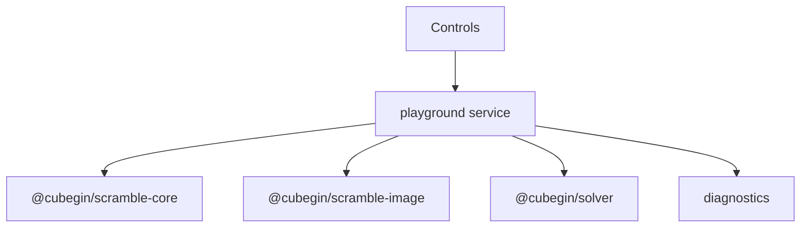

# Scramble Playground App



`apps/playground` is a developer test workbench for exercising the scramble and
solver packages without wiring them into production apps.

## Key Rules

- It imports package source through Vite aliases for fast local feedback.
- It is allowed to run generation on the main thread because it is not a
  production app.
- The Solvers tab calls `@cubegin/solver` through the playground service boundary
  and is for manual auxiliary/full-solver diagnostics, not production timer
  integration.
- In the Solvers tab, changing the solver event resets event-specific method and
  target defaults and auto-generates a scramble for the selected event.
- The 3x3 solver method list includes the cstimer-style staged helpers,
  TwoPhase, and General mask diagnostics.
- `?seed=<integer>` provides deterministic browser smoke and future E2E runs.
- `333mbld` attempts are split into one displayed row per cube.
- The SVG preview includes a `2D` / `3D` image-view switch. `2D` is the default
  net renderer; `3D` requests the optional isometric `scramble-image` renderer
  and naturally falls back for unsupported event families.

## Verify

```bash
pnpm --filter playground test
pnpm --filter playground typecheck
pnpm --filter playground build
```

## Key Files

- [apps/playground/src/playground/playground-service.ts#L1](../../../apps/playground/src/playground/playground-service.ts#L1) - package adapter.
- [apps/playground/src/playground/use-playground.ts#L1](../../../apps/playground/src/playground/use-playground.ts#L1) - React state boundary.
- [apps/playground/src/app.tsx#L1](../../../apps/playground/src/app.tsx#L1) - Scrambles and Solvers tab composition.
- [packages/solver/src/index.ts#L1](../../../packages/solver/src/index.ts#L1) - auxiliary solver API used by the Solvers tab.
- [docs/apps/playground/diagnostics-and-e2e.md](diagnostics-and-e2e.md) - diagnostics and E2E guidance.

---

_Last updated: 2026-06-09 | Reason: document 3x3 General solver diagnostics_
