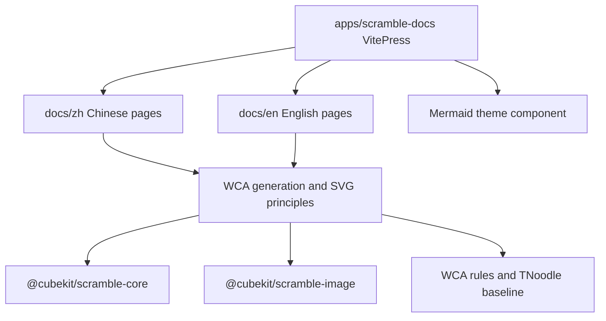

# Scramble Docs App



`apps/scramble-docs` is a static learning site. It explains the scramble
generation and scramble image rendering model without importing runtime package
APIs into the documentation pages.

## Key Rules

- Treat the site as educational material, not an official WCA scramble program.
- Keep Chinese and English pages structurally aligned when adding learning
  topics.
- Mermaid fences are rendered through the VitePress theme component, so diagrams
  should stay small enough to render comfortably in the browser.
- Runtime demos belong in `apps/playground`; this app should link concepts back
  to package docs and source boundaries.

## Verify

```bash
pnpm --filter scramble-docs build
pnpm build:scramble-docs
```

## Key Files

- [apps/scramble-docs/docs/.vitepress/config.mts#L1](../../../apps/scramble-docs/docs/.vitepress/config.mts#L1) - locale routing, nav, sidebars, and Mermaid fence conversion.
- [apps/scramble-docs/docs/.vitepress/theme/components/MermaidDiagram.vue#L1](../../../apps/scramble-docs/docs/.vitepress/theme/components/MermaidDiagram.vue#L1) - client-side Mermaid renderer.
- [apps/scramble-docs/docs/zh/index.md#L1](../../../apps/scramble-docs/docs/zh/index.md#L1) - Chinese learning entry.
- [apps/scramble-docs/docs/en/index.md#L1](../../../apps/scramble-docs/docs/en/index.md#L1) - English learning entry.

---

_Last updated: 2026-05-26 | Reason: add app-scoped knowledge for scramble docs_
