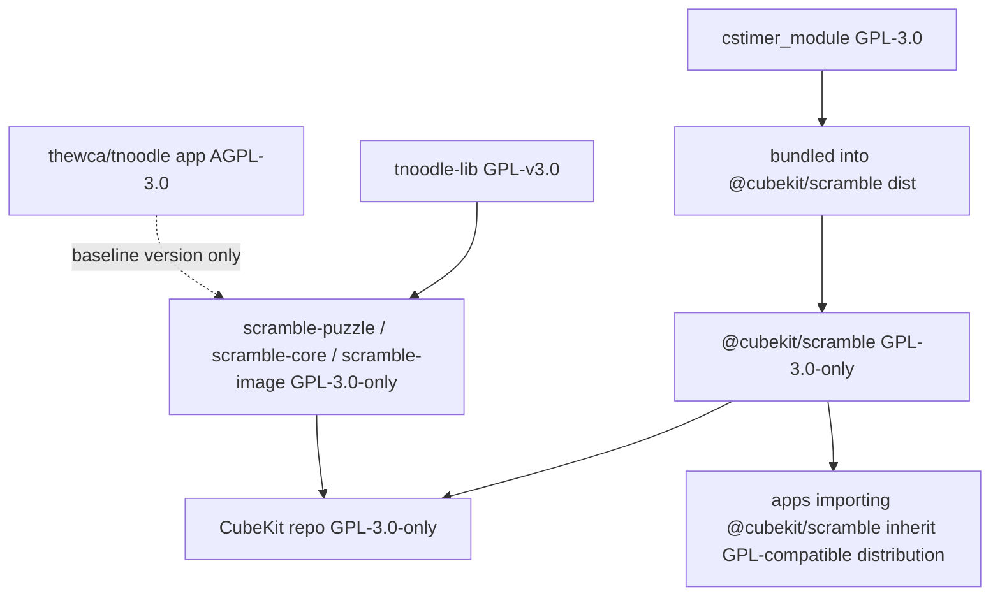

# Dependency Licensing

CubeKit is GPL-3.0-only because `@cubekit/scramble` bundles GPL-3.0 cstimer
code into its published output. The new TNoodle-compatible packages track
`thewca/tnoodle-lib`, whose `lib-scrambles` artifact is GPL-v3.0. Treat bundling
and source-provenance decisions as licensing decisions, not only build decisions.

## Key Rules

- The root package license is GPL-3.0-only. See [package.json#L5](../package.json#L5)
  and [README.md#L5](../README.md#L5).
- `@cubekit/scramble` must stay GPL-3.0-only while it bundles `cstimer_module`. See
  [packages/scramble/package.json#L5](../packages/scramble/package.json#L5).
- `@cubekit/scramble-puzzle`, `@cubekit/scramble-core`, and
  `@cubekit/scramble-image` are GPL-3.0-only while they port TNoodle-compatible
  behavior from the GPL `tnoodle-lib` baseline. See
  [docs/tnoodle-baseline.md#L1](tnoodle-baseline.md#L1).
- `thewca/tnoodle` itself is AGPL-3.0, but the migrated logic target is
  `thewca/tnoodle-lib` / Maven `lib-scrambles` GPL-v3.0. Do not copy server/UI
  code from the AGPL app repository into these packages without a separate
  license review.
- `cstimer_module` is deliberately bundled by
  [packages/scramble/vite.config.ts#L10](../packages/scramble/vite.config.ts#L10);
  consumers do not declare it themselves.
- Published scramble packages must ship GPL text and attribution through their
  `LICENSE` and `NOTICE` files. The legacy wrapper does this through
  [packages/scramble/package.json#L6](../packages/scramble/package.json#L6),
  [packages/scramble/LICENSE#L1](../packages/scramble/LICENSE#L1), and
  [packages/scramble/NOTICE#L1](../packages/scramble/NOTICE#L1).
- Before adding any dependency to `deps.alwaysBundle`, `noExternal`, or another
  static bundling path, inspect its package license and shipped license file.
  Do not rely only on the package.json `license` field.

## Escape Hatches

- To pursue permissive app distribution later, change the scramble boundary
  first: replace cstimer with a compatible library or load cstimer out of process
  so it is not bundled into the distributed app code.
- Do not "fix" package licenses to MIT while GPL cstimer code remains bundled.
- License changes for the TNoodle-compatible packages need a separate legal and
  source-provenance review; do not change package licenses in a puzzle update.

## Open Questions

- TODO: If CubeKit starts publishing separate packages independently, document
  which outputs import `@cubekit/scramble` and which remain license-isolated.

---

_Last updated: 2026-05-26 | Reason: align GPL-3.0-only package licensing and TNoodle provenance_
