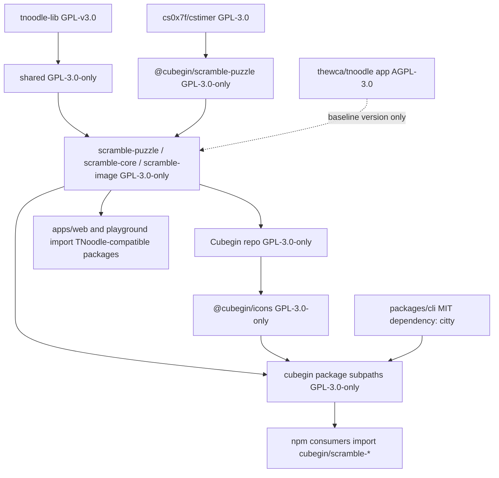

# Dependency Licensing

Cubegin is GPL-3.0-only because the TNoodle-compatible packages track
`thewca/tnoodle-lib`, whose `lib-scrambles` artifact is GPL-v3.0. FTO puzzle
state support also references GPL-3.0 code from `cs0x7f/cstimer`. The legacy
`packages/scramble` cstimer wrapper has been removed; do not restore it without
a fresh license and distribution review. Treat bundling and source-provenance
decisions as licensing decisions, not only build decisions.

## Key Rules

- The root package license is GPL-3.0-only. See [package.json#L5](../package.json#L5)
  and [README.md#L5](../README.md#L5).
- `@cubegin/shared`, `@cubegin/scramble-puzzle`, `@cubegin/scramble-core`, and
  `@cubegin/scramble-image` are GPL-3.0-only while they carry WCA metadata or
  port TNoodle-compatible behavior from the GPL `tnoodle-lib` baseline. See
  [docs/tnoodle-baseline.md#L1](tnoodle-baseline.md#L1).
- `cubegin` is GPL-3.0-only while it bundles those TNoodle-compatible packages
  through `cubegin/scramble-core`, `cubegin/scramble-image`, and
  `cubegin/scramble-puzzle`; `cubegin/icons` is also GPL-3.0-only as part
  of the repository-owned public package surface.
- `thewca/tnoodle` itself is AGPL-3.0, but the migrated logic target is
  `thewca/tnoodle-lib` / Maven `lib-scrambles` GPL-v3.0. Do not copy server/UI
  code from the AGPL app repository into these packages without a separate
  license review.
- FTO notation/state support may use GPL-3.0 source-provenance from
  `cs0x7f/cstimer` for the face-turning octahedron cubie and facelet model.
  Keep this attribution in package NOTICE files when modifying the FTO model.
- Published scramble packages and the public `cubegin` aggregation package must
  ship GPL text and attribution through their `LICENSE` and `NOTICE` files.
- `citty` is an MIT-licensed runtime dependency for the public `cubegin` CLI and
  is not part of the TNoodle-compatible ported source.
- Before adding any dependency to `deps.alwaysBundle`, `noExternal`, or another
  static bundling path, inspect its package license and shipped license file.
  Do not rely only on the package.json `license` field.

## Escape Hatches

- To pursue permissive app distribution later, change the scramble boundary
  first by replacing the GPL-derived scramble implementation or isolating it out
  of distributed app code.
- License changes for the TNoodle-compatible packages need a separate legal and
  source-provenance review; do not change package licenses in a puzzle update.

---

_Last updated: 2026-06-30 | Reason: record FTO csTimer source-provenance boundary_
