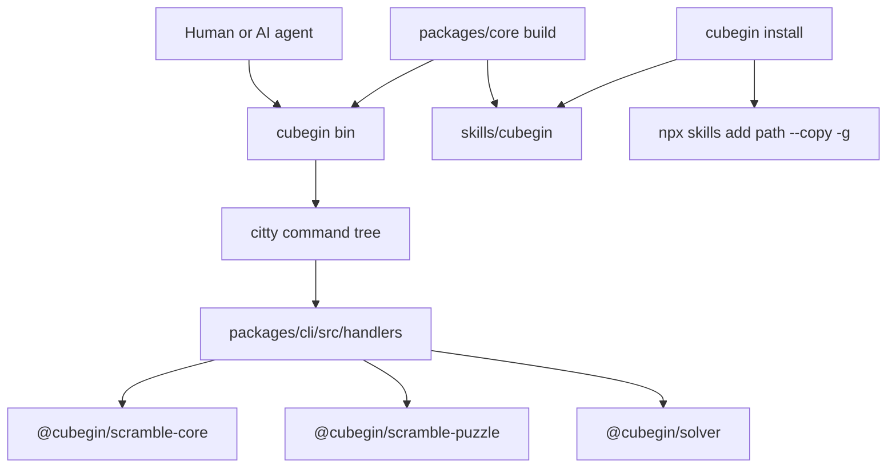

# CLI Package



`@cubegin/cli` owns the source for the public `cubegin` command. The published
binary is emitted by the `cubegin` aggregation package rather than by publishing
`@cubegin/cli` as a separate public package.

## Key Rules

- Keep command parsing in [packages/cli/src/index.ts](../../../packages/cli/src/index.ts#L1)
  thin. Reusable behavior belongs in [packages/cli/src/handlers](../../../packages/cli/src/handlers).
- Agent-facing commands must support `--json` and return the stable envelope
  from [packages/cli/src/output.ts](../../../packages/cli/src/output.ts#L1).
- Human output is display-only. Skills and agents should parse only `--json`.
- `cubegin install` asks whether to install globally, then delegates actual
  agent selection and directory handling to `npx skills`.
- The install command uses the bundled
  [skills/cubegin/SKILL.md](../../../skills/cubegin/SKILL.md#L1) path
  and `--copy -g` so temporary `npx cubegin@latest` cache paths are not used as
  durable skill symlinks.
- Do not import DOM, browser globals, Taro, React, or app code from CLI handlers.

## Verify

```bash
pnpm --filter @cubegin/cli test
pnpm --filter @cubegin/cli typecheck
pnpm --filter cubegin build
node packages/core/dist/cli.mjs scramble events --json
node packages/core/dist/cli.mjs install --yes --dry-run
```

## Commands

- `cubegin install`
- `cubegin skill info`
- `cubegin skill path`
- `cubegin scramble events`
- `cubegin scramble generate <event>`
- `cubegin scramble render <event> <scramble>`
- `cubegin solver events`
- `cubegin solver methods <event>`
- `cubegin solver assist <event> <scramble>`

---

_Last updated: 2026-06-13 | Reason: document initial public CLI and agent skill boundary_
