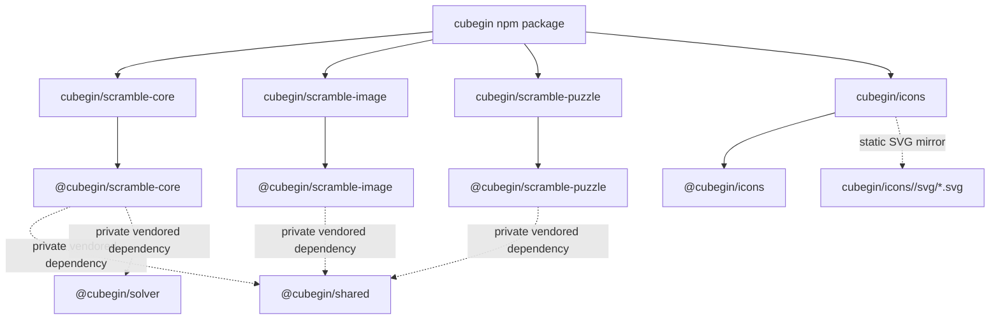

# Core Package



`packages/core` owns the public `cubegin` npm package. It is a bundled package
boundary that exposes selected reusable packages through package subpaths. The
package root intentionally has no export so consumers must choose a stable
subpath.

## Public Paths

- `cubegin/scramble-core`
- `cubegin/icons`
- `cubegin/icons/brand`
- `cubegin/icons/brand/svg/<iconId>.svg`
- `cubegin/icons/events`
- `cubegin/icons/events/svg/<eventId>.svg`
- `cubegin/icons/react`
- `cubegin/scramble-image`
- `cubegin/scramble-puzzle`

## Verification

```bash
pnpm --filter cubegin test
pnpm --filter cubegin typecheck
pnpm --filter cubegin build
```

## Release

The manual `Release cubegin` GitHub Action accepts `patch`, `minor`, or
`major`. It runs `packages/core/scripts/release.mjs`, validates the public
package, creates an npm tarball artifact, and commits the updated
`packages/core/package.json` version plus `packages/core/CHANGELOG.md` back to
`main`. Publishing uses npm Trusted Publishing through GitHub Actions OIDC, so
the workflow needs `id-token: write` and does not use an `NPM_TOKEN` secret.
After npm publish succeeds, the workflow pushes a `cubegin@<version>` git tag so
the next changelog only includes commits since the last published version.

Configure npm Trusted Publishing for `cubegin` with GitHub repository
`deweyou/cube-kit`, workflow filename `release-cubegin.yml`, and the default
branch `main`.

The release script discovers changelog scope from `packages/core` and every
package with `cubegin.publicSubpath`, keeping the public package workflow aligned
with the build script.

## Notes

- Keep subpaths mapped to packages under `packages/*` through the source
  package's `cubegin.publicSubpath` package metadata.
- `packages/core/scripts/build.mjs` scans those markers, syncs the public
  `exports` map, vendors source into `.build/vendor`, and runs `vp pack` in
  `unbundle` mode so the published package keeps internal ESM module boundaries.
- The build script also vendors workspace runtime dependencies required by those
  public packages without adding matching public `cubegin/*` exports.
- The icons subpath also mirrors static SVG files such as
  `cubegin/icons/events/svg/333.svg` and
  `cubegin/icons/brand/svg/cubegin-mark.svg`.
- `pnpm --filter cubegin build` must work from a clean checkout. Static SVG
  mirroring should not require a pre-existing ignored `packages/icons/dist`; the
  core build can copy source SVG files or generate them from built SVG maps.
- Do not copy implementation logic into this package.
- Do not publish runtime dependencies on unpublished `@cubegin/*` packages.
- Keep GPL-3.0-only while exported paths depend on TNoodle-compatible packages.

---

_Last updated: 2026-06-09 | Reason: record clean-checkout static SVG release build boundary_
