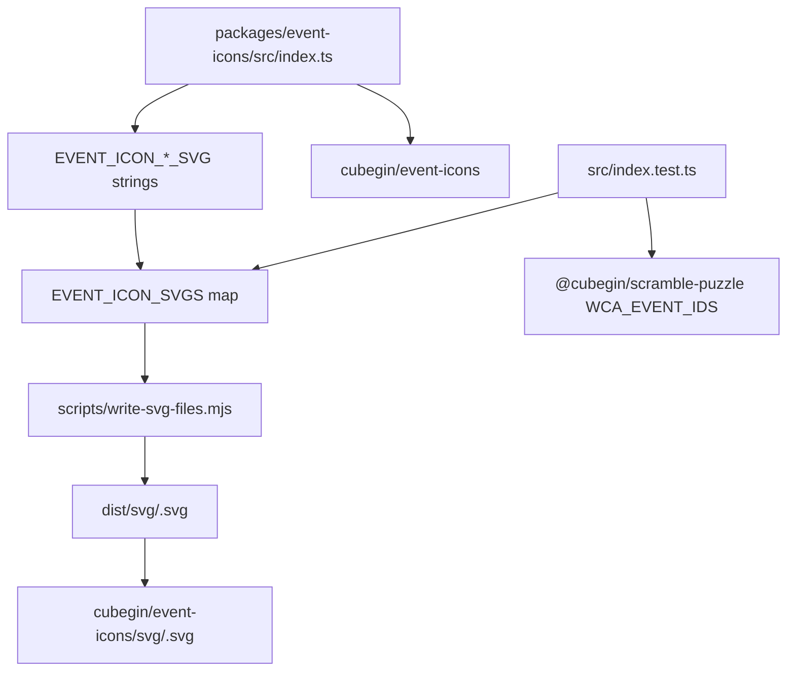

# Event Icons Design



`@cubegin/event-icons` is a static icon package. Its source code may generate SVG
strings internally, but the public API should feel like assets: named SVG string
exports, an event-id map, and generated `.svg` files.

## Public Shape

- Keep the root export static: `EVENT_ICON_<EVENT_ID>_SVG` constants plus
  `EVENT_ICON_SVGS`.
- Do not expose public generator/query helpers such as `getEventIconSvg`; callers
  should import static SVG data or direct SVG files.
- Build `dist/svg/<eventId>.svg` from `EVENT_ICON_SVGS`, and mirror those files
  through `cubegin/event-icons/svg/<eventId>.svg`.
- Keep `@cubegin/scramble-puzzle` out of runtime dependencies. It is only a dev
  dependency for tests that assert the icon set matches `WCA_EVENT_IDS`.

## Drawing Contract

- Every icon uses `viewBox="0 0 24 24"` and `fill="currentColor"`.
- The artwork should occupy the full drawing area when the event shape supports
  it; avoid baked-in outer padding.
- Do not encode visible white strokes or fills. Gaps, outlines, and labels that
  need to knock through the icon must use masks or cutouts so they work on any
  background.
- Keep SVG output DOM-free and platform-agnostic. No React, browser, Taro, CSS,
  or external image dependencies belong in this package.
- Use stable, readable path helpers when they protect a visual invariant, but
  keep the exported API asset-like.

## Visual Grammar

- Cube events `222` through `777` use a shared grid grammar with a `0.8` gap.
  Lower-order cubes have proportionally stronger inner rounding, while `666` and
  `777` thicken the outside band slightly.
- Blindfolded events reuse their base cube grid and add a bottom-half goggle
  overlay. The goggle outline is a cutout and should sit flush with the left,
  right, and bottom edges.
- `333fm` reuses the `333` grid with a diagonal pen overlay. The pen separation
  and outer outline are cutouts, not painted white.
- `333oh` reuses the `333` grid with the imported hand silhouette transformed
  into filled currentColor plus cutout stroke detail. Adjust position/scale, not
  the hand anatomy.
- `clock`, `minx`, `pyram`, `skewb`, and `sq1` should follow the same
  full-viewBox, single-color, cutout-safe rules as cube events.

## Verification

```bash
pnpm --filter @cubegin/event-icons test
pnpm --filter @cubegin/event-icons typecheck
pnpm --filter @cubegin/event-icons build
pnpm --filter cubegin build
pnpm --filter playground test -- src/app.test.tsx
```

Use package smoke checks when changing exports or generated files:

```bash
pnpm --dir packages/event-icons exec node --input-type=module -e "const icons = await import('@cubegin/event-icons'); console.log(Object.keys(icons.EVENT_ICON_SVGS).length)"
pnpm --dir packages/event-icons exec node --input-type=module -e "console.log(import.meta.resolve('@cubegin/event-icons/svg/333.svg'))"
pnpm --dir packages/core exec node --input-type=module -e "console.log(import.meta.resolve('cubegin/event-icons/svg/333.svg'))"
npm pack --dry-run --json
```

## Key Files

- [packages/event-icons/src/index.ts#L1](../../../packages/event-icons/src/index.ts#L1) - SVG source and public static exports.
- [packages/event-icons/scripts/write-svg-files.mjs#L1](../../../packages/event-icons/scripts/write-svg-files.mjs#L1) - generated per-event SVG writer.
- [packages/core/scripts/build.mjs#L1](../../../packages/core/scripts/build.mjs#L1) - public facade build and SVG mirroring.
- [apps/playground/src/app.tsx#L1](../../../apps/playground/src/app.tsx#L1) - interactive icon gallery.

---

_Last updated: 2026-06-09 | Reason: capture event-icons static asset API and SVG drawing contract_
