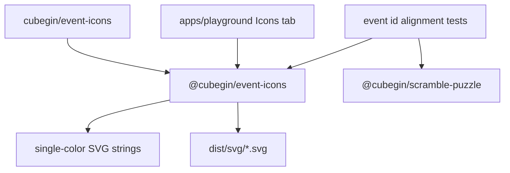

# Event Icons Package



`packages/event-icons` owns platform-agnostic SVG glyphs for the 17 WCA events.
It exposes `currentColor` SVG strings that apps can render in React, browser
DOM, or other UI shells without a runtime DOM dependency. Package builds also
emit one static SVG file per event under `dist/svg`.

## Public API

- `EVENT_ICON_<EVENT_ID>_SVG` constants export one SVG string per event, for
  example `EVENT_ICON_333_SVG`.
- `EVENT_ICON_SVGS` maps every event id to its SVG string.
- `@cubegin/event-icons/svg/<eventId>.svg` resolves to the generated SVG file
  for a single event, for example `@cubegin/event-icons/svg/333.svg`.
- The public `cubegin` facade mirrors those files at
  `cubegin/event-icons/svg/<eventId>.svg`.

## Design Notes

- [DESIGN.md](DESIGN.md) records the static asset API, SVG drawing contract,
  mask/cutout rules, and package smoke checks.

## Verification

```bash
pnpm --filter @cubegin/event-icons test
pnpm --filter @cubegin/event-icons typecheck
pnpm --filter @cubegin/event-icons build
pnpm --filter playground test -- src/app.test.tsx
```

---

_Last updated: 2026-06-09 | Reason: document event icon package boundary and public SVG asset API_
