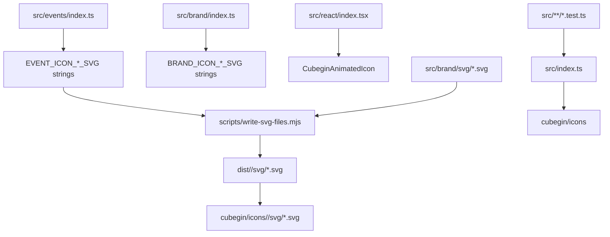

# Icons Design



`@cubegin/icons` separates static SVG assets from animated React behavior. Asset
groups expose named SVG string exports, group maps, and generated or copied
`.svg` files. The React subpath owns animation triggers and playback policy for
the Cubegin mark.

## Public Shape

- Keep asset groups explicit: `events` and `brand`.
- Keep root export as a convenience barrel only; public consumers should prefer
  group imports when they know the asset family.
- Do not expose generator/query helpers such as `getEventIconSvg`; callers
  should import static SVG data or direct SVG files.
- Build event files from `EVENT_ICON_SVGS`; copy brand files from
  `src/brand/svg`.
- Mirror static asset exports through `cubegin/icons/<group>/svg/<id>.svg` using
  `cubegin.staticAssetExports` metadata.
- Keep `@cubegin/scramble-puzzle` out of runtime dependencies. It is only a dev
  dependency for tests that assert the event icon set matches `WCA_EVENT_IDS`.
- Keep React behavior in `@cubegin/icons/react`; do not duplicate Cubegin mark
  geometry in standalone animated SVG assets.

## Drawing Contract

- Event icons use `viewBox="0 0 24 24"` and `fill="currentColor"`.
- Event icon artwork should occupy the full drawing area when the event shape
  supports it; avoid baked-in outer padding.
- Event icon gaps, outlines, and labels that need to knock through the icon must
  use masks or cutouts, not visible white strokes or fills.
- Brand assets may be multi-color SVGs.
- React components may embed SVG style tags for animation, but must not depend on
  external CSS, JS, remote resources, or platform APIs.
- Keep non-React SVG output DOM-free and platform-agnostic. No browser, Taro,
  CSS imports, or external image dependencies belong in this package.

## Visual Grammar

- Cube events `222` through `777` use a shared grid grammar with a `0.8` gap.
  Lower-order cubes have proportionally stronger inner rounding, while `666` and
  `777` thicken the outside band slightly.
- Blindfolded events reuse their base cube grid and add a bottom-half goggle
  overlay. The goggle outline is a cutout and should sit flush with the left,
  right, and bottom edges.
- `333fm` reuses the `333` grid with a diagonal pen overlay. The pen separation
  and outer outline are cutouts, not painted white.
- `333oh` reuses the `333` grid with the imported hand silhouette transformed
  into filled currentColor plus cutout stroke detail. Adjust position/scale, not
  the hand anatomy.
- `clock`, `minx`, `pyram`, `skewb`, and `sq1` should follow the same
  full-viewBox, single-color, cutout-safe rules as cube events.

## Verification

```bash
pnpm --filter @cubegin/icons test
pnpm --filter @cubegin/icons typecheck
pnpm --filter @cubegin/icons build
pnpm --filter cubegin build
pnpm --filter playground test -- src/app.test.tsx
```

Use package smoke checks when changing exports or generated files:

```bash
pnpm --dir packages/icons exec node --input-type=module -e "const icons = await import('@cubegin/icons/events'); console.log(Object.keys(icons.EVENT_ICON_SVGS).length)"
pnpm --dir packages/icons exec node --input-type=module -e "console.log(import.meta.resolve('@cubegin/icons/events/svg/333.svg'))"
pnpm --dir packages/icons exec node --input-type=module -e "console.log(import.meta.resolve('@cubegin/icons/brand/svg/cubegin-mark.svg'))"
pnpm --dir packages/icons exec node --input-type=module -e "const icons = await import('@cubegin/icons/react'); console.log(typeof icons.CubeginAnimatedIcon)"
pnpm --dir packages/core exec node --input-type=module -e "console.log(import.meta.resolve('cubegin/icons/events/svg/333.svg'))"
npm pack --dry-run --json
```

## Key Files

- [packages/icons/src/events/index.ts#L1](../../../packages/icons/src/events/index.ts#L1) - WCA event SVG source and exports.
- [packages/icons/src/brand/index.ts#L1](../../../packages/icons/src/brand/index.ts#L1) - Cubegin brand SVG string exports.
- [packages/icons/src/react/index.tsx#L1](../../../packages/icons/src/react/index.tsx#L1) - animated Cubegin mark React components.
- [packages/icons/scripts/write-svg-files.mjs#L1](../../../packages/icons/scripts/write-svg-files.mjs#L1) - static SVG writer and copier.
- [packages/core/scripts/build.mjs#L1](../../../packages/core/scripts/build.mjs#L1) - public facade build and SVG mirroring.
- [apps/playground/src/app.tsx#L1](../../../apps/playground/src/app.tsx#L1) - interactive icon gallery.

---

_Last updated: 2026-06-09 | Reason: move animated Cubegin mark behavior to React components_
