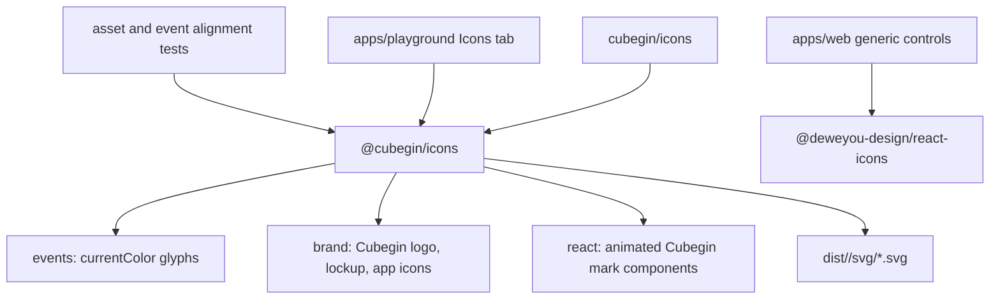

# Icons Package



`packages/icons` owns SVG assets and React icon components for Cubegin. Static
asset groups expose SVG strings and direct SVG files; the React subpath owns
interactive Cubegin mark animation behavior.

## Ownership Boundary

- Keep Cubegin brand marks, event glyphs, and animated Cubegin marks in
  `@cubegin/icons`.
- Generic application controls such as navigation, add, edit, delete, copy,
  settings, refresh, expand, and close use `@deweyou-design/react-icons`; do not
  redraw them in app-local SVG components or text/emoji glyphs.
- Scramble renderings remain generated output owned by
  [`@cubegin/scramble-image`](../scramble-image/index.md#L1). Framework-owned
  icons, such as VitePress theme icons, remain with their framework.

## Public API

- `@cubegin/icons/events` exports `EVENT_ICON_<EVENT_ID>_SVG` constants and
  `EVENT_ICON_SVGS` for the 18 supported events.
- `@cubegin/icons/brand` exports `BRAND_ICON_<ID>_SVG` constants and
  `BRAND_ICON_SVGS` for Cubegin marks, lockups, wordmarks, and app icons.
- `@cubegin/icons/react` exports `CubeginAnimatedIcon` with `auto`, `hover`,
  `loop`, and `manual` playback triggers.
- Direct files resolve through `@cubegin/icons/<group>/svg/<id>.svg`.
- The public `cubegin` facade mirrors group imports at `cubegin/icons/<group>`
  and direct files through `cubegin/icons/<group>/svg/<id>.svg`.

## Design Notes

- [DESIGN.md](DESIGN.md) records the static asset API, SVG drawing contracts,
  asset groups, and package smoke checks.

## Verification

```bash
pnpm --filter @cubegin/icons test
pnpm --filter @cubegin/icons typecheck
pnpm --filter @cubegin/icons build
pnpm --filter playground test -- src/app.test.tsx
```

---

_Last updated: 2026-07-22 | Reason: record the domain-versus-generic icon ownership boundary_
