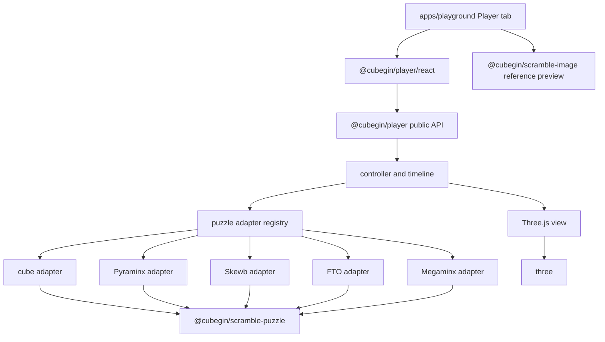

# Player Package



`@cubegin/player` owns browser-side Three.js formula playback for Cubegin puzzle
events. It is a separate visualization package: parser and state semantics stay
in `@cubegin/scramble-puzzle`, static SVG rendering stays in
`@cubegin/scramble-image`, and React is exposed only through the `./react`
subpath.

## Key Rules

- Keep Three.js, DOM, canvas, and React code inside `packages/player`; do not
  move those concerns into scramble packages.
- Parse formulas through puzzle definitions from
  [@cubegin/scramble-puzzle](../../../packages/scramble-puzzle/src/index.ts#L1).
- Keep the imperative controller framework-independent. The React component
  owns only mount/dispose wiring and UI state handoff.
- The Player tab can display a `scramble-image` reference preview, but the
  player package must not import or depend on `@cubegin/scramble-image`.
- Supported player events are cube-family events from `222` through `777`,
  their shared-size BLD/FM/OH/MBLD aliases, plus `pyram`, `skewb`, `fto`, and
  `minx`.
- `clock` and `sq1` remain unsupported player events and should surface a typed
  unsupported-event state until adapters are designed.
- Static non-cube geometry and move-map provenance is recorded in
  [packages/player/NOTICE](../../../packages/player/NOTICE) and
  [docs/dependency-licensing.md](../../dependency-licensing.md#L1).

## Verify

```bash
pnpm --filter @cubegin/player test
pnpm --filter @cubegin/player typecheck
pnpm --filter @cubegin/player build
pnpm --filter playground typecheck
```

## Key Files

- [packages/player/src/index.ts#L1](../../../packages/player/src/index.ts#L1) - public imperative exports.
- [packages/player/src/react/player.tsx#L1](../../../packages/player/src/react/player.tsx#L1) - React wrapper used by the playground.
- [packages/player/src/core/player-controller.ts#L1](../../../packages/player/src/core/player-controller.ts#L1) - playback, seeking, speed, and error orchestration.
- [packages/player/src/core/timeline.ts#L1](../../../packages/player/src/core/timeline.ts#L1) - move-step timeline model.
- [packages/player/src/events/event-map.ts#L1](../../../packages/player/src/events/event-map.ts#L1) - event support mapping.
- [packages/player/src/puzzles/puzzle-registry.ts#L1](../../../packages/player/src/puzzles/puzzle-registry.ts#L1) - adapter lookup.
- [packages/player/src/puzzles/cube/cube-player-adapter.ts#L1](../../../packages/player/src/puzzles/cube/cube-player-adapter.ts#L1) - cube-family adapter.
- [packages/player/src/puzzles/pyraminx/pyraminx-player-adapter.ts#L1](../../../packages/player/src/puzzles/pyraminx/pyraminx-player-adapter.ts#L1) - Pyraminx adapter.
- [packages/player/src/puzzles/skewb/skewb-player-adapter.ts#L1](../../../packages/player/src/puzzles/skewb/skewb-player-adapter.ts#L1) - Skewb adapter.
- [packages/player/src/puzzles/fto/fto-player-adapter.ts#L1](../../../packages/player/src/puzzles/fto/fto-player-adapter.ts#L1) - FTO adapter.
- [packages/player/src/puzzles/megaminx/megaminx-player-adapter.ts#L1](../../../packages/player/src/puzzles/megaminx/megaminx-player-adapter.ts#L1) - Megaminx adapter.
- [packages/player/src/three/three-player-view.ts#L1](../../../packages/player/src/three/three-player-view.ts#L1) - disposable Three.js scene and render loop.
- [apps/playground/src/app.tsx#L1](../../../apps/playground/src/app.tsx#L1) - Player tab composition.

---

_Last updated: 2026-07-01 | Reason: document the new Three.js player package and playground integration_
