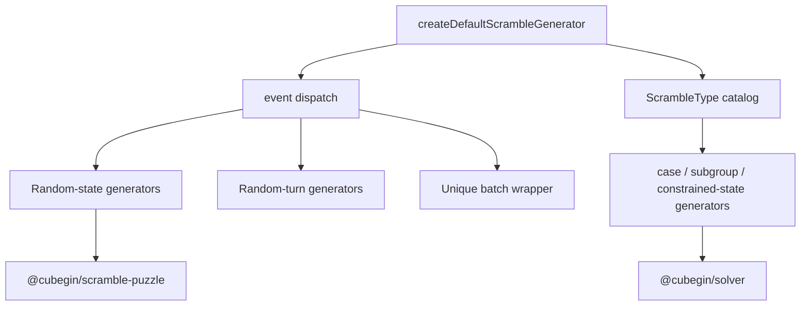

# Scramble Core Package



`@cubegin/scramble-core` owns event-based scramble generation. TNoodle-compatible
events use TNoodle-derived random-state and random-turn implementations. The
same async-shaped facade owns 94 training ids backed by cases, restricted
subgroups, templates, or constrained states; Megaminx and FTO delegate their
coordinate-heavy paths to `@cubegin/solver`.

## Key Rules

- All supported events are dispatched from
  [packages/scramble-core/src/generator.ts#L1](../../../packages/scramble-core/src/generator.ts#L1).
- Training metadata is owned by
  [packages/scramble-core/src/catalog.ts#L1](../../../packages/scramble-core/src/catalog.ts#L1);
  apps must not rebuild the id taxonomy.
- `333mbld` returns one multi-line attempt containing one 3x3 no-inspection
  scramble per cube.
- Heavy solvers and random-state implementations stay internal to this package.
- Do not wire this package into production apps without a separate runtime and
  worker verification task.

## Verify

```bash
pnpm --filter @cubegin/scramble-core test
pnpm --filter @cubegin/scramble-core test:coverage
pnpm --filter @cubegin/scramble-core typecheck
```

## Key Files

- [packages/scramble-core/src/generator.ts#L1](../../../packages/scramble-core/src/generator.ts#L1) - facade and event dispatch.
- [packages/scramble-core/src/batch.ts#L1](../../../packages/scramble-core/src/batch.ts#L1) - unique batch generation.
- [docs/training-scramble-system.md](../../training-scramble-system.md) - training catalog, state, case, and source contract.
- [docs/packages/scramble-core/wca-generation-rules.md](wca-generation-rules.md) - WCA rule mapping.
- [docs/packages/scramble-core/test-coverage.md](test-coverage.md) - coverage policy and residual solver gaps.

---

_Last updated: 2026-07-27 | Reason: document the complete training scramble facade_
