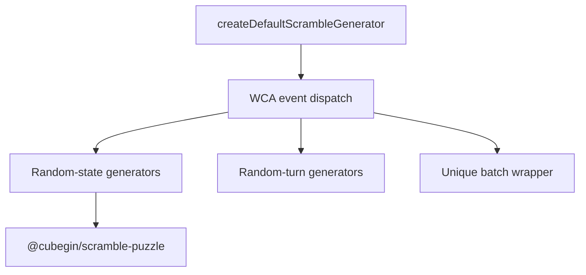

# Scramble Core Package



`@cubegin/scramble-core` owns TNoodle-compatible WCA scramble generation. Its
public facade is async-shaped so generation can move behind a worker boundary
without changing callers.

## Key Rules

- All 17 WCA events are dispatched from
  [packages/scramble-core/src/generator.ts#L1](../../../packages/scramble-core/src/generator.ts#L1).
- `333mbld` returns one multi-line attempt containing one 3x3 no-inspection
  scramble per cube.
- Heavy solvers and random-state implementations stay internal to this package.
- Do not wire this package into production apps without a separate runtime and
  worker verification task.

## Verify

```bash
pnpm --filter @cubegin/scramble-core test
pnpm --filter @cubegin/scramble-core test:coverage
pnpm --filter @cubegin/scramble-core typecheck
```

## Key Files

- [packages/scramble-core/src/generator.ts#L1](../../../packages/scramble-core/src/generator.ts#L1) - facade and event dispatch.
- [packages/scramble-core/src/batch.ts#L1](../../../packages/scramble-core/src/batch.ts#L1) - unique batch generation.
- [docs/packages/scramble-core/wca-generation-rules.md](wca-generation-rules.md) - WCA rule mapping.
- [docs/packages/scramble-core/test-coverage.md](test-coverage.md) - coverage policy and residual solver gaps.

---

_Last updated: 2026-05-26 | Reason: add package-scoped knowledge for scramble-core_
