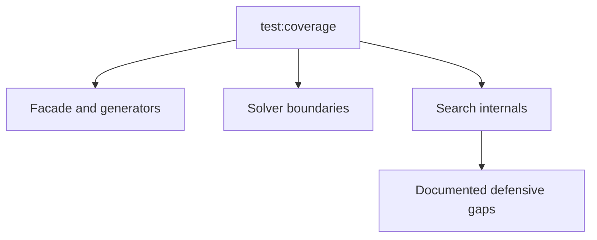

# Scramble Core Test Coverage



Coverage for `@cubegin/scramble-core` is strongest around public generation
contracts and solver boundaries. Deep search engines contain defensive branches
that are not useful to force through synthetic table corruption.

## Current Thresholds

- Statements: `94.73`
- Branches: `85.99`
- Functions: `96.95`
- Lines: `95.17`

## Residual Gaps

- `min2phase`, `threephase`, and `sq12phase` internal search fallbacks and table
  overflow guards.
- Defensive random-source error branches that require invalid coordinates after
  upstream validation.
- Rare solver failure paths that are covered at the generator boundary where the
  public error contract lives.

## Verify

```bash
pnpm --filter @cubegin/scramble-core test:coverage
```

---

_Last updated: 2026-05-26 | Reason: record scramble-core coverage policy_
