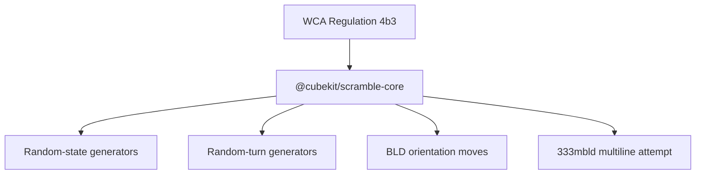

# WCA Generation Rules

`@cubekit/scramble-core` implements the testable WCA generation rules used by the
17 supported WCA event ids. The tests assert structure and minimum-distance
filters; they do not attempt statistical proof of randomness.

## Key Rules

- `222` filters sampled states that can be solved in fewer than 4 moves before
  generating an 11-move scramble.
- Skewb filters states solvable in fewer than 7 moves.
- Pyraminx filters states solvable in fewer than 6 moves and appends tips outside
  the main move distance.
- Square-1 filters states solvable in fewer than 11 WCA turns and uses the
  Square-1 search metric.
- `333bld`, `444bld`, `555bld`, and `333mbld` append no-inspection orientation
  moves.
- `555`, `666`, `777`, and Megaminx use fixed random-turn lengths.

## Key Files

- [packages/scramble-core/src/generators/two-by-two.ts#L1](../../../packages/scramble-core/src/generators/two-by-two.ts#L1) - 2x2 WCA minimum-distance filter.
- [packages/scramble-core/src/generators/skewb.ts#L1](../../../packages/scramble-core/src/generators/skewb.ts#L1) - Skewb minimum-distance filter.
- [packages/scramble-core/src/generators/pyraminx.ts#L1](../../../packages/scramble-core/src/generators/pyraminx.ts#L1) - Pyraminx minimum-distance filter.
- [packages/scramble-core/src/generators/square1.ts#L1](../../../packages/scramble-core/src/generators/square1.ts#L1) - Square-1 minimum-distance filter.
- [packages/scramble-core/src/generators/three-by-three.ts#L1](../../../packages/scramble-core/src/generators/three-by-three.ts#L1) - 3x3, BLD, FMC, and MBLD generation.

---

_Last updated: 2026-05-26 | Reason: document scramble-core WCA generation rules_
