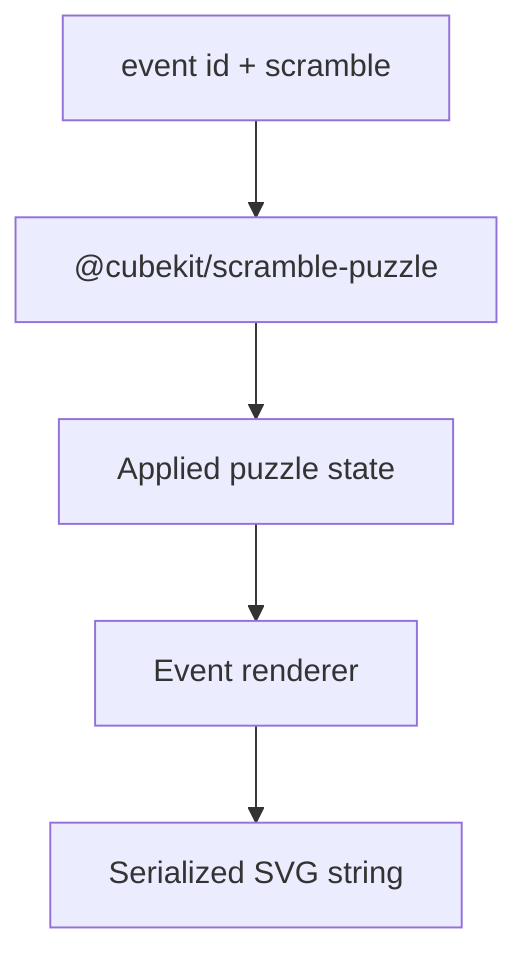

# Scramble Image Package



`@cubekit/scramble-image` renders DOM-free SVG previews from puzzle states. It
depends on `scramble-puzzle` for parsing and state application, then serializes a
single SVG string.

## Key Rules

- `renderScrambleImage(eventId, scramble)` is the public dispatch boundary.
- Renderers must not touch DOM APIs.
- SVG serialization escapes attribute values and text content.
- Cube, Clock, Megaminx, Pyraminx, Skewb, and Square-1 renderers own their own
  layout contracts.

## Verify

```bash
pnpm --filter @cubekit/scramble-image test
pnpm --filter @cubekit/scramble-image test:coverage
pnpm --filter @cubekit/scramble-image typecheck
```

## Key Files

- [packages/scramble-image/src/render.ts#L1](../../../packages/scramble-image/src/render.ts#L1) - WCA event dispatch.
- [packages/scramble-image/src/svg/svg-serialize.ts#L1](../../../packages/scramble-image/src/svg/svg-serialize.ts#L1) - SVG escaping and serialization.
- [docs/packages/scramble-image/renderer-contracts.md](renderer-contracts.md) - renderer contracts.
- [docs/packages/scramble-image/test-coverage.md](test-coverage.md) - coverage policy.

---

_Last updated: 2026-05-26 | Reason: add package-scoped knowledge for scramble-image_
