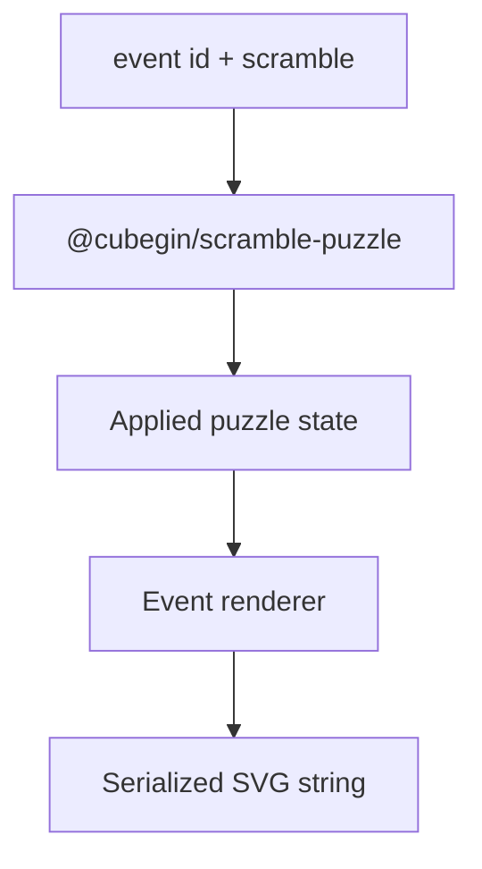

# Scramble Image Package



`@cubegin/scramble-image` renders DOM-free SVG previews from puzzle states. It
depends on `scramble-puzzle` for parsing and state application, then serializes a
single SVG string. The default output remains the TNoodle-compatible 2D net;
callers can opt into fixed isometric SVG previews for cube, Megaminx, Pyraminx,
and Skewb events with `renderScrambleImage(eventId, scramble, { view:
'isometric' })`.

## Key Rules

- `renderScrambleImage(eventId, scramble, options?)` is the public dispatch
  boundary. Omitted options and `view: 'net'` use the existing 2D output.
- `view: 'isometric'` renders fixed-view SVG for cube, Megaminx, Pyraminx, and
  Skewb events. Clock and Square-1 intentionally fall back to their existing 2D
  renderers.
- Cube isometric output uses paired `U/F/R` and `D/B/L` views so all six cube
  faces are inspectable from one static SVG.
- Megaminx isometric output uses paired `F`-center and `B`-center views so all
  12 Megaminx faces are inspectable from one static SVG.
- Pyraminx isometric output uses a three-face `F/L/R` view plus a flat `D`
  companion face so all four Pyraminx faces are inspectable from one static SVG.
- Skewb isometric output uses paired `U/L/F` and `R/B/D` views so all six Skewb
  faces are inspectable from one static SVG.
- Renderers must not touch DOM APIs.
- SVG serialization escapes attribute values and text content.
- Cube, Clock, Megaminx, Pyraminx, Skewb, and Square-1 renderers own their own
  layout contracts.

## Verify

```bash
pnpm --filter @cubegin/scramble-image test
pnpm --filter @cubegin/scramble-image test:coverage
pnpm --filter @cubegin/scramble-image typecheck
```

## Key Files

- [packages/scramble-image/src/render.ts#L1](../../../packages/scramble-image/src/render.ts#L1) - WCA event dispatch.
- [packages/scramble-image/src/renderers/cube-isometric.ts#L1](../../../packages/scramble-image/src/renderers/cube-isometric.ts#L1) - cube fixed-view isometric renderer.
- [packages/scramble-image/src/svg/svg-serialize.ts#L1](../../../packages/scramble-image/src/svg/svg-serialize.ts#L1) - SVG escaping and serialization.
- [docs/packages/scramble-image/renderer-contracts.md](renderer-contracts.md) - renderer contracts.
- [docs/packages/scramble-image/test-coverage.md](test-coverage.md) - coverage policy.

---

_Last updated: 2026-06-06 | Reason: document optional isometric renderers_
