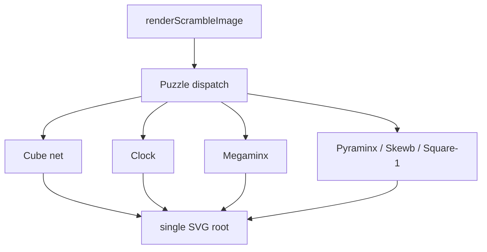

# Renderer Contracts

Renderer tests assert visible SVG contracts: one root document, stable viewBox
shape, expected element counts, custom color handling, and safe escaping.

## Key Rules

- Renderers should accept solved and scrambled states from `scramble-puzzle`.
- Unknown facelet indexes fall back to existing default colors rather than
  emitting unsafe attributes.
- Empty polygon helper guards remain private defensive branches; public renderers
  should not create empty sticker polygons.
- SVG output is a string, not a DOM node, so app integration can run in Node,
  browser workers, and test environments.

## Key Files

- [packages/scramble-image/src/renderers/cube-net.ts#L1](../../../packages/scramble-image/src/renderers/cube-net.ts#L1) - cube net renderer.
- [packages/scramble-image/src/renderers/megaminx.ts#L1](../../../packages/scramble-image/src/renderers/megaminx.ts#L1) - Megaminx renderer.
- [packages/scramble-image/src/renderers/square1.ts#L1](../../../packages/scramble-image/src/renderers/square1.ts#L1) - Square-1 renderer.

---

_Last updated: 2026-05-26 | Reason: document scramble-image renderer contracts_
