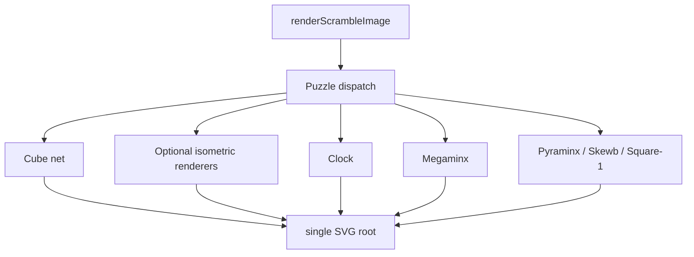

# Renderer Contracts

Renderer tests assert visible SVG contracts: one root document, stable viewBox
shape, expected element counts, custom color handling, and safe escaping.

## Key Rules

- Renderers should accept solved and scrambled states from `scramble-puzzle`.
- Unknown facelet indexes fall back to existing default colors rather than
  emitting unsafe attributes.
- Empty polygon helper guards remain private defensive branches; public renderers
  should not create empty sticker polygons.
- `renderScrambleImage(..., { view: 'isometric' })` is a fixed-view SVG preview,
  not interactive 3D. Cube, Megaminx, Pyraminx, and Skewb own separate
  isometric contracts.
- Cube isometric renders two fixed three-face views, `U/F/R` and `D/B/L`, to
  expose all six faces without requiring rotation.
- Megaminx isometric renders paired `F`-center and `B`-center views to expose
  all 12 faces without requiring rotation.
- Pyraminx isometric renders a fixed three-face `F/L/R` view plus a flat `D`
  companion face to expose all four faces without requiring rotation.
- Skewb isometric renders two fixed three-face views, `U/L/F` and `R/B/D`, to
  expose all six faces without requiring rotation.
- Clock and Square-1 use their existing 2D renderers when `view: 'isometric'`
  is requested.
- SVG output is a string, not a DOM node, so app integration can run in Node,
  browser workers, and test environments.

## Key Files

- [packages/scramble-image/src/renderers/cube-net.ts#L1](../../../packages/scramble-image/src/renderers/cube-net.ts#L1) - cube net renderer.
- [packages/scramble-image/src/renderers/cube-isometric.ts#L1](../../../packages/scramble-image/src/renderers/cube-isometric.ts#L1) - cube fixed-view isometric renderer.
- [packages/scramble-image/src/renderers/megaminx.ts#L1](../../../packages/scramble-image/src/renderers/megaminx.ts#L1) - Megaminx renderer.
- [packages/scramble-image/src/renderers/megaminx-isometric.ts#L1](../../../packages/scramble-image/src/renderers/megaminx-isometric.ts#L1) - Megaminx fixed-view isometric renderer.
- [packages/scramble-image/src/renderers/pyraminx-isometric.ts#L1](../../../packages/scramble-image/src/renderers/pyraminx-isometric.ts#L1) - Pyraminx fixed-view isometric renderer.
- [packages/scramble-image/src/renderers/skewb-isometric.ts#L1](../../../packages/scramble-image/src/renderers/skewb-isometric.ts#L1) - Skewb fixed-view isometric renderer.
- [packages/scramble-image/src/renderers/square1.ts#L1](../../../packages/scramble-image/src/renderers/square1.ts#L1) - Square-1 renderer.

---

_Last updated: 2026-06-06 | Reason: document optional isometric renderer contracts_
