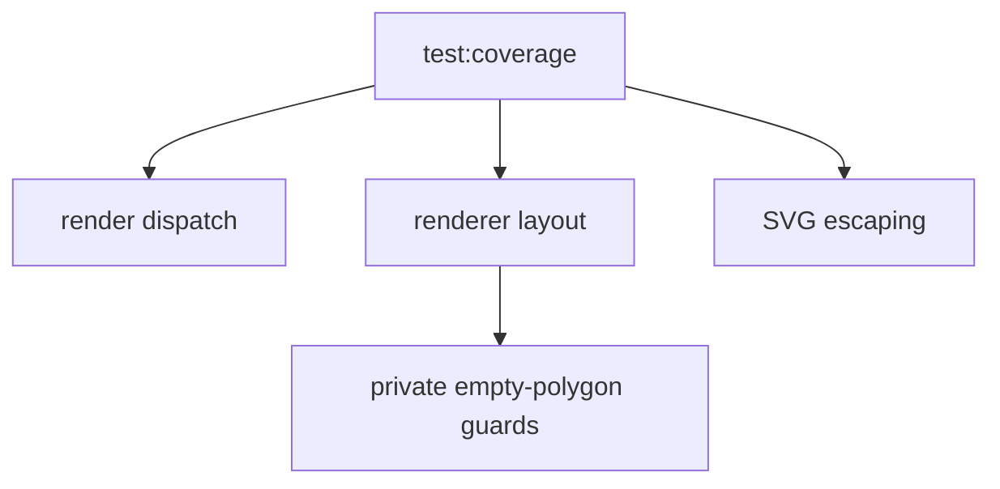

# Scramble Image Test Coverage



Coverage for `@cubegin/scramble-image` is near-complete around public rendering
contracts and SVG safety.

## Current Thresholds

- Statements: `99.08`
- Branches: `96.72`
- Functions: `100`
- Lines: `100`

## Residual Gaps

- Private empty-polygon guard branches in renderer-local `polygonPath([])`
  helpers. These are defensive guards and are not reachable through meaningful
  public renderer contracts.

## Verify

```bash
pnpm --filter @cubegin/scramble-image test:coverage
```

---

_Last updated: 2026-05-26 | Reason: record scramble-image coverage policy_
