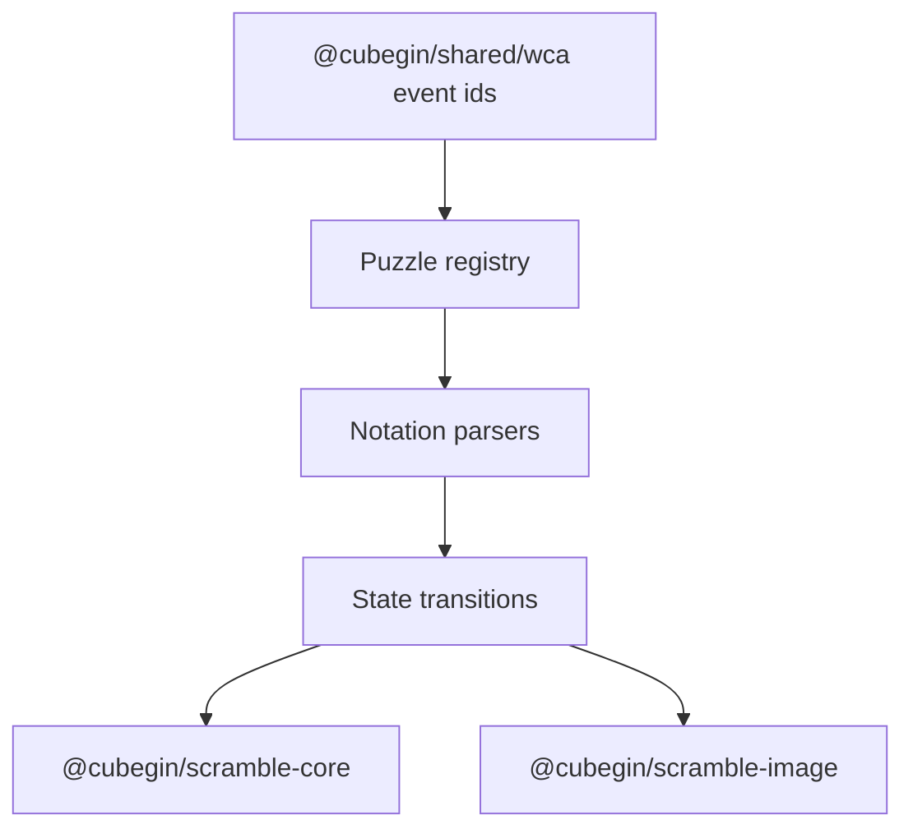

# Scramble Puzzle Package



`@cubegin/scramble-puzzle` is the shared puzzle-domain layer for the new
TNoodle-compatible packages. It owns parser contracts, solved states, move
application, and registry helpers. WCA event metadata lives in
`@cubegin/shared/wca` and is re-exported here for compatibility.

## Key Rules

- Keep this package platform-agnostic: no DOM, React, Taro, worker, or browser
  globals in `src/`.
- WCA ids and puzzle routing live in
  [packages/shared/src/wca/events.ts#L1](../../../packages/shared/src/wca/events.ts#L1).
- Public puzzle definitions expose `parseAlgorithm`, `applyMove`,
  `applyAlgorithm`, `createSolvedState`, and `isSolved`.
- State objects should be immutable at creation boundaries where the existing
  implementation already freezes them.

## Verify

```bash
pnpm --filter @cubegin/scramble-puzzle test
pnpm --filter @cubegin/scramble-puzzle test:coverage
pnpm --filter @cubegin/scramble-puzzle typecheck
```

## Key Files

- [packages/scramble-puzzle/src/index.ts#L1](../../../packages/scramble-puzzle/src/index.ts#L1) - public exports.
- [packages/scramble-puzzle/src/events.ts#L1](../../../packages/scramble-puzzle/src/events.ts#L1) - compatibility re-export of shared WCA metadata.
- [packages/shared/src/wca/events.ts#L1](../../../packages/shared/src/wca/events.ts#L1) - canonical WCA event metadata.
- [packages/scramble-puzzle/src/puzzle-definition.ts#L1](../../../packages/scramble-puzzle/src/puzzle-definition.ts#L1) - shared puzzle interface.
- [docs/packages/scramble-puzzle/wca-notation-and-state.md](wca-notation-and-state.md) - notation and state invariants.
- [docs/packages/scramble-puzzle/test-coverage.md](test-coverage.md) - coverage policy and remaining gaps.

---

_Last updated: 2026-06-09 | Reason: move WCA metadata ownership into shared_
